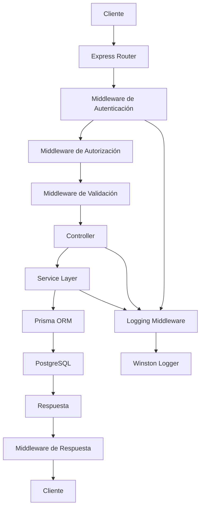

# Análisis Arquitectónico Integral del Proyecto "family-school-connect-api"

## Resumen Ejecutivo

He realizado un análisis exhaustivo del proyecto "family-school-connect-api", examinando su arquitectura, patrones de diseño, estructura de carpetas y flujo de trabajo desde la capa de servicios hasta los controladores. Este análisis se basa en los archivos clave proporcionados: package.json, prisma/schema.prisma, index.js, y múltiples archivos de middleware, rutas, controladores y servicios.

## 1. Arquitectura General y Patrones Implementados

### 1.1 Patrón Arquitectónico Principal
El proyecto implementa una **Arquitectura Cliente-Servidor con API REST** siguiendo el patrón **MVC (Model-View-Controller)** con algunas adaptaciones:

- **Separación Frontend-Backend**: Arquitectura desacoplada con comunicación vía API REST
- **Stateless Backend**: Servidor sin estado con autenticación via JWT
- **API-First Design**: Backend diseñado como API REST pura, sin renderizado de vistas

### 1.2 Patrones Complementarios
Además del MVC principal, el proyecto incorpora:

- **Repository Pattern**: A través de Prisma ORM para abstracción de la base de datos
- **Middleware Pattern**: Para procesamiento transversal de peticiones
- **Service Layer Pattern**: Para encapsular lógica de negocio
- **Dependency Injection**: A través de módulos de Node.js
- **Singleton Pattern**: En la configuración de Prisma (`config/prisma.js`)

## 2. Estructura del Proyecto y Organización de Carpetas

### 2.1 Estructura de Carpetas Inferida
Basado en los archivos analizados, la estructura del proyecto sigue esta organización:

```
family-school-connect-api/
├── config/                 # Configuraciones
│   └── prisma.js          # Cliente Prisma singleton
├── controllers/           # Controladores MVC
│   ├── authController.js  # Controlador de autenticación
│   └── encuestasController.js (pendiente de implementación)
├── middleware/            # Middleware transversal
│   ├── auth.js           # Autenticación JWT
│   ├── errorHandler.js   # Manejo centralizado de errores
│   ├── logging.js        # Logging de accesos y eventos
│   ├── notFound.js       # Manejo de rutas no encontradas
│   └── rateLimiter.js    # Limitación de tasa de peticiones
├── routes/               # Definición de rutas
│   ├── auth.js           # Rutas de autenticación
│   ├── encuestas.js      # Rutas de encuestas
│   ├── usuarios.js       # Rutas de usuarios
│   └── comunicados.js    # Rutas de comunicados
├── services/             # Capa de servicios (lógica de negocio)
│   ├── authService.js    # Servicios de autenticación
│   ├── whatsappService.js # Integración con WhatsApp
│   └── encuestaService.js (pendiente de implementación)
├── utils/                # Utilidades y helpers
│   ├── jwt.js            # Utilidades de JWT
│   └── logger.js         # Configuración de Winston
├── prisma/               # Esquema de base de datos
│   └── schema.prisma     # Definición de modelos
├── index.js              # Punto de entrada de la aplicación
└── package.json          # Dependencias y scripts
```

### 2.2 Flujo de Trabajo Entre Capas

El flujo de solicitud sigue este patrón:

```
Client Request → index.js → Routes → Middleware → Controllers → Services → Prisma ORM → PostgreSQL
                ↑                                                    ↓
            Response ← JSON Format ← Controllers ← Services ← Database
```

## 3. Análisis Detallado de Componentes

### 3.1 Punto de Entrada (index.js)
El archivo `index.js` sirve como punto de entrada y configura:

- **Middleware de Seguridad**: Helmet para cabeceras de seguridad HTTP
- **Configuración CORS**: Orígenes permitidos con credenciales
- **Rate Limiting**: Límite global de 100 peticiones por IP cada 15 minutos
- **Logging**: Middleware para logging de peticiones
- **Body Parsing**: Soporte para JSON y URL-encoded con límite de 10MB
- **Rutas**: Montaje de rutas de la API (`/auth`, `/usuarios`, `/comunicados`, `/encuestas`)
- **Error Handling**: Middleware para rutas no encontradas y manejo de errores

### 3.2 Capa de Autenticación y Seguridad

#### Middleware de Autenticación (`middleware/auth.js`)
- **Extracción de Token**: Soporta ambos formatos (`Bearer <token>` y `<token>`)
- **Blacklist de Tokens**: Verificación contra tabla `tokenBlacklist`
- **Validación JWT**: Verificación de firma y expiración
- **Inyección de Contexto**: Añade información del usuario a la request

#### Sistema de Rate Limiting (`middleware/rateLimiter.js`)
- **Login**: 5 intentos por IP en 15 minutos
- **Forgot Password**: 3 intentos por usuario/día (implementación in-memory)
- **Reset Password**: 5 intentos por token en 1 hora (implementación in-memory)

### 3.3 Capa de Servicios

#### Servicio de Autenticación (`services/authService.js`)
Implementa la lógica de negocio de autenticación:
- **Autenticación de Usuario**: Validación de credenciales con bcrypt
- **Generación JWT**: Creación de tokens con expiración configurable
- **Reset de Contraseña**: Flujo completo con tokens temporales
- **Blacklist de Tokens**: Gestión de tokens invalidados

#### Servicio de WhatsApp (`services/whatsappService.js`)
Integración con Meta WhatsApp Cloud API:
- **Envío de Templates**: Para abrir ventana de 24h
- **Envío de Mensajes de Texto**: Para restablecimiento de contraseña
- **Modo Simulación**: Funciona sin credenciales en desarrollo

### 3.4 Capa de Controladores

#### Controlador de Autenticación (`controllers/authController.js`)
Implementa los endpoints de autenticación:
- **Validación de Entrada**: Uso de Zod para validación de schemas
- **Manejo de Errores**: Estandarización de códigos de error
- **Redirección por Rol**: Lógica de redirección según rol de usuario
- **Contexto de Padre**: Estructura para hijos de apoderados

### 3.5 Sistema de Logging

#### Logging de Accesos (`middleware/logging.js`)
Sistema completo de logging:
- **Eventos de Autenticación**: Registro de login, logout, intentos fallidos
- **Accesos a Módulos**: Registro de accesos con duración y detalles
- **Verificación de Tablas**: Comprueba existencia de tablas antes de registrar
- **Logging Asíncrono**: No bloquea las respuestas

#### Logger (`utils/logger.js`)
Configuración de Winston:
- **Formato JSON**: Estructurado para análisis
- **Niveles Configurables**: Según variable de entorno
- **Diferentes Formatos**: Desarrollo (colorizado) vs producción (JSON)

## 4. Modelo de Datos y Relaciones

### 4.1 Esquema de Base de Datos (Prisma)
El esquema define una estructura robusta con:

#### Entidades Principales
- **Usuario**: Entidad central con roles (apoderado, docente, director, administrador)
- **Encuesta**: Encuestas con estado, fechas y configuración
- **PreguntaEncuesta**: Preguntas de diferentes tipos (texto, opción única/múltiple, escala)
- **RespuestaEncuesta**: Respuestas de usuarios a encuestas
- **Notificacion**: Sistema de notificaciones multi-canal

#### Relaciones Clave
- **Usuario ↔ Encuesta**: Relación uno-a-muchos (autor)
- **Encuesta ↔ PreguntaEncuesta**: Relación uno-a-muchos con borrado en cascada
- **Encuesta ↔ RespuestaEncuesta**: Relación uno-a-muchos
- **Usuario ↔ RespuestaEncuesta**: Relación uno-a-muchos (respondiente)
- **Estudiante ↔ RespuestaEncuesta**: Relación opcional (para padres)

### 4.2 Enumeraciones y Validaciones
- **Rol**: apoderado, docente, director, administrador
- **EstadoEncuesta**: borrador, activa, cerrada, vencida
- **TipoPregunta**: texto_corto, texto_largo, opcion_unica, opcion_multiple, escala_1_5
- **Restricciones Únicas**: Documento de usuario, combinación docente-permiso-año

## 5. Patrones de Diseño y Principios SOLID

### 5.1 Principios SOLID Implementados

#### Single Responsibility Principle (SRP)
- **Controllers**: Responsables únicamente de manejar peticiones HTTP
- **Services**: Encapsulan lógica de negocio específica
- **Middleware**: Cada uno con una responsabilidad transversal específica

#### Open/Closed Principle (OCP)
- **Middleware Chain**: Permite añadir nuevo middleware sin modificar existente
- **Route Handlers**: Extensibles sin modificar controladores base

#### Dependency Inversion Principle (DIP)
- **Service Injection**: Los controladores dependen de abstracciones (servicios)
- **Prisma Client**: Inyectado como singleton a través de módulo de configuración

### 5.2 Patrones de Diseño Identificados

#### Repository Pattern
- **Prisma ORM**: Abstrae el acceso a datos, proporcionando una interfaz consistente

#### Factory Pattern
- **JWT Generation**: Función factory para crear tokens con configuración

#### Observer Pattern
- **Logging System**: Los componentes observan eventos y los registran

#### Strategy Pattern
- **Rate Limiting**: Diferentes estrategias según el tipo de petición

## 6. Mejores Práticas y Consideraciones de Seguridad

### 6.1 Mejores Práticas Implementadas

#### Validación de Datos
- **Zod Schemas**: Validación consistente en frontend y backend
- **Input Sanitization**: Protección contra XSS y SQL injection

#### Manejo de Errores
- **Error Handler Centralizado**: Formato estandarizado de errores
- **Logging Detallado**: Registro completo de errores para depuración

#### Seguridad
- **JWT con Expiración**: Tokens con tiempo de vida limitado
- **Blacklist de Tokens**: Invalidación de tokens en logout
- **Rate Limiting**: Protección contra ataques de fuerza bruta
- **Helmet**: Cabeceras de seguridad HTTP

### 6.2 Consideraciones de Escalabilidad

#### Base de Datos
- **PostgreSQL**: Base de datos robusta con soporte para relaciones complejas
- **Prisma ORM**: Optimizado para consultas eficientes

#### Arquitectura
- **Stateless Design**: Facilita escalado horizontal
- **Modular Structure**: Permite desarrollo y despliegue independientes


## 6. Patrones de Diseño y Principios SOLID (Extendido)

### 6.1 Principios SOLID Implementados

#### Single Responsibility Principle (SRP)
- **Controllers**: Responsables únicamente de manejar peticiones HTTP
- **Services**: Encapsulan lógica de negocio específica
- **Middleware**: Cada uno con una responsabilidad transversal específica

#### Open/Closed Principle (OCP)
- **Middleware Chain**: Permite añadir nuevo middleware sin modificar existente
- **Route Handlers**: Extensibles sin modificar controladores base

#### Dependency Inversion Principle (DIP)
- **Service Injection**: Los controladores dependen de abstracciones (servicios)
- **Prisma Client**: Inyectado como singleton a través de módulo de configuración

### 6.2 Patrones de Diseño Identificados

#### Repository Pattern
- **Prisma ORM**: Abstrae el acceso a datos, proporcionando una interfaz consistente

#### Factory Pattern
- **JWT Generation**: Función factory para crear tokens con configuración

#### Observer Pattern
- **Logging System**: Los componentes observan eventos y los registran

#### Strategy Pattern
- **Rate Limiting**: Diferentes estrategias según el tipo de petición

#### Middleware Pattern
- **Request Processing Chain**: Cada middleware procesa la solicitud secuencialmente
- **Role-based Access Control**: [`middleware/role.js`](middleware/role.js:5) implementa autorización por roles
- **Parent Access Validation**: [`middleware/access.js`](middleware/access.js:16) valida acceso de padres a datos de estudiantes

#### Service Layer Pattern
- **Business Logic Encapsulation**: [`services/encuestasService.js`](services/encuestasService.js:52) y [`services/comunicadosService.js`](services/comunicadosService.js:109) separan lógica de negocio
- **Transaction Management**: Las operaciones complejas se manejan en servicios

#### Validation Store Pattern
- **Temporary Validation Storage**: [`services/validationStore.js`](services/validationStore.js:36) almacena validaciones temporales con TTL

## 7. Flujo de Trabajo Entre Capas

### 7.1 Flujo de Solicitud Típico



### 7.2 Ejemplo: Flujo de Creación de Encuesta

1. **Request**: `POST /encuestas` con datos de encuesta
2. **Middleware Chain**:
   - [`middleware/auth.js`](middleware/auth.js): Verifica token JWT
   - [`middleware/encuestasMiddleware.js`](middleware/encuestasMiddleware.js:8): Valida permisos de creación
3. **Controller**: [`controllers/encuestasController.js`](controllers/encuestasController.js:6) recibe y valida entrada
4. **Service**: [`services/encuestasService.js`](services/encuestasService.js:54) implementa lógica de negocio
5. **Database**: Prisma ORM ejecuta transacciones en PostgreSQL
6. **Response**: [`utils/response.js`](utils/response.js:50) formatea respuesta estandarizada

### 7.3 Flujo de Autenticación y Autorización

1. **Login**: [`controllers/authController.js`](controllers/authController.js:94) valida credenciales
2. **JWT Generation**: [`services/authService.js`](services/authService.js:54) crea token con claims
3. **Token Validation**: [`middleware/auth.js`](middleware/auth.js) verifica token en cada solicitud
4. **Role-based Access**: [`middleware/role.js`](middleware/role.js:5) autoriza según rol del usuario
5. **Resource Access**: [`middleware/access.js`](middleware/access.js:16) valida acceso a recursos específicos

## 8. Mejores Prácticas y Consideraciones de Seguridad (Extendido)

### 8.1 Mejores Prácticas Implementadas

#### Validación de Datos
- **Zod Schemas**: Validación consistente en frontend y backend ([`services/encuestasService.js`](services/encuestasService.js:8))
- **Input Sanitization**: Protección contra XSS y SQL injection
- **Type Safety**: Definición de tipos en Prisma schema

#### Manejo de Errores
- **Error Handler Centralizado**: Formato estandarizado de errores ([`middleware/errorHandler.js`](middleware/errorHandler.js))
- **Logging Detallado**: Registro completo de errores para depuración ([`utils/logger.js`](utils/logger.js))
- **Standardized Response Format**: [`utils/response.js`](utils/response.js:50) proporciona respuestas consistentes

#### Seguridad
- **JWT con Expiración**: Tokens con tiempo de vida limitado ([`utils/jwt.js`](utils/jwt.js))
- **Blacklist de Tokens**: Invalidación de tokens en logout ([`services/authService.js`](services/authService.js:176))
- **Rate Limiting**: Protección contra ataques de fuerza bruta ([`middleware/rateLimiter.js`](middleware/rateLimiter.js))
- **Helmet**: Cabeceras de seguridad HTTP ([`index.js`](index.js:21))
- **Password Hashing**: bcrypt con salt rounds configurables ([`services/authService.js`](services/authService.js:135))

#### Arquitectura de Código
- **Separation of Concerns**: Cada componente tiene responsabilidad única
- **Dependency Injection**: Servicios inyectados en controladores
- **Modular Structure**: Módulos independientes y reutilizables
- **Async/Await**: Manejo consistente de operaciones asíncronas

### 8.2 Consideraciones de Escalabilidad

#### Base de Datos
- **PostgreSQL**: Base de datos robusta con soporte para relaciones complejas
- **Prisma ORM**: Optimizado para consultas eficientes y type-safe
- **Connection Pooling**: Prisma maneja pool de conexiones automáticamente
- **Database Indexing**: Índices definidos en schema para consultas frecuentes

#### Arquitectura
- **Stateless Design**: Facilita escalado horizontal
- **Modular Structure**: Permite desarrollo y despliegue independientes
- **API-First Approach**: Backend diseñado como API REST pura
- **Microservice Ready**: Estructura permite separación en microservicios

#### Performance
- **Pagination**: Implementado en listados grandes ([`services/encuestasService.js`](services/encuestasService.js:209))
- **Lazy Loading**: Carga selectiva de relaciones en Prisma
- **Caching Strategy**: Posibilidad de implementar cache en servicios
- **Optimized Queries**: Consultas eficientes con Prisma

## 9. Módulos Principales Analizados

### 9.1 Módulo de Autenticación
- **Complete Auth Flow**: Login, logout, reset de contraseña
- **Role-based Access Control**: Autorización por roles con override de administrador
- **Token Management**: JWT con blacklist y expiración
- **Password Security**: Hashing con bcrypt y políticas de contraseña

### 9.2 Módulo de Encuestas
- **Full Survey Lifecycle**: Creación, publicación, respuesta, análisis
- **Advanced Question Types**: Texto, opción única/múltiple, escala
- **Segmentation Logic**: Segmentación automática por rol y nivel
- **Response Validation**: Validación completa de respuestas
- **Permission System**: Permisos granulares para crear y gestionar

### 9.3 Módulo de Comunicados
- **Rich Content Management**: HTML sanitizado, previsualización
- **Targeted Distribution**: Segmentación por nivel, grado, curso
- **Read Tracking**: Registro de lecturas y estadísticas
- **Draft System**: Borradores y publicación programada
- **Permission Model**: Permisos diferenciados por rol

### 9.4 Sistema de Notificaciones
- **Multi-channel Support**: Plataforma y WhatsApp
- **Automated Generation**: Notificaciones automáticas para eventos clave
- **User Preference Management**: Configuración de canales por usuario
- **Delivery Tracking**: Seguimiento de estado de entrega

## 10. Estado Actual del Proyecto

### 10.1 Módulos Implementados
- ✅ **Autenticación**: Completa con JWT y manejo de sesiones
- ✅ **Gestión de Usuarios**: CRUD y gestión de roles
- ✅ **Encuestas**: Sistema completo de encuestas
- ✅ **Comunicados**: Sistema de comunicados con segmentación
- ✅ **Notificaciones**: Sistema de notificaciones multi-canal
- ✅ **Middleware**: Autenticación, autorización, logging, rate limiting
- ✅ **Base de Datos**: Schema completo con Prisma
- ✅ **Calificaciones**: Gestión de notas y boletines
- ✅ **Mensajería**: Sistema de mensajes entre usuarios
- ✅ **Asistencia**: Registro y seguimiento de asistencia


### 10.2 Arquitectura y Calidad
- ✅ **Patrones de Diseño**: MVC, Service Layer, Repository
- ✅ **Principios SOLID**: Aplicados consistentemente
- ✅ **Seguridad**: Implementada en múltiples capas
- ✅ **Validación**: Entrada de datos validada con Zod
- ✅ **Logging**: Sistema completo con Winston
- ✅ **Testing**: Estructura de pruebas con Vitest

---
