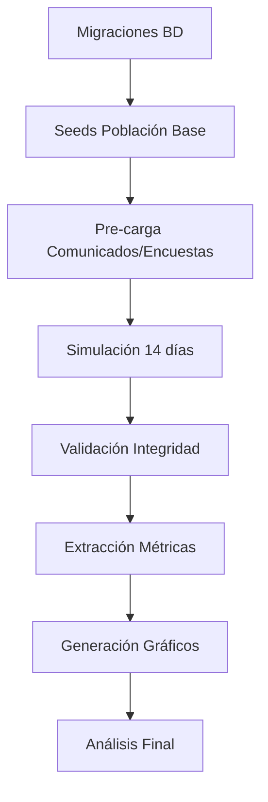

# PLANNING FASE 3: VALIDACIÓN ACTIVA MEDIANTE SIMULACIÓN (14 DÍAS)

**Fecha de elaboración:** Enero 2025  
**Responsable:** Metodólogo Técnico y Líder QA/DevOps  
**Objetivo del documento:** Planificar técnicamente la simulación de 14 días de uso del sistema mediante scripts ejecutables que generen datos reales para validar las 14 métricas definidas en la Matriz de Operacionalización.

---

## 1. OBJETIVOS DE LA SIMULACIÓN

### 1.1 Objetivo General

Validar el cumplimiento de los objetivos específicos de la investigación mediante la ejecución de scripts automatizados que simulen el comportamiento de 4 instancias de usuario durante 14 días continuos, generando datos reales de interacción que permitan calcular las 14 métricas definidas en la Matriz de Operacionalización y demostrar empíricamente la efectividad de la plataforma web.

### 1.2 Objetivos Específicos Medibles

| **Objetivo de Investigación** | **Métricas Asociadas** | **Criterio de Éxito Cuantificable** |
|---|---|---|
| **OE1:** Facilitar acceso oportuno y seguro a información académica | M1, M2, M3, M9, M10 | ≥80% de métricas superen umbrales objetivo |
| **OE2:** Garantizar comunicación institucional oportuna y efectiva | M4, M5, M6, M11, M12 | ≥80% de métricas superen umbrales objetivo |
| **OE3:** Garantizar sostenibilidad y mejora continua | M7, M8, M13, M14 | ≥70% de métricas superen umbrales aceptables |

### 1.3 Criterios de Éxito de la Simulación

**Criterio 1 - Completitud de Datos:**
- 100% de registros esperados generados en tablas `auth_logs` (60-68 registros) y `access_logs` (180-220 registros)
- 100% de eventos de cronograma ejecutados según especificación de [`doc/neotesis/Simulacion.md`](doc/neotesis/Simulacion.md:407-429)

**Criterio 2 - Realismo de Comportamiento:**
- Distribución horaria coherente (30% mañana, 40% tarde, 30% noche para padre según [`Simulacion.md:32-34`](doc/neotesis/Simulacion.md:32-34))
- Tiempos de reacción a alertas dentro de rangos esperados (≤2h para alertas críticas según [`metrica.md:582`](doc/neotesis/metrica.md:582))
- Patrones temporales sin anomalías (no logins futuros, no timestamps negativos)

**Criterio 3 - Validación de Métricas:**
- 14 métricas calculables sin errores de datos faltantes
- ≥70% de métricas cumplan umbrales mínimos aceptables
- 0 inconsistencias lógicas (ej: comunicado leído antes de publicarse)

---

## 2. PLAN DE PREPARACIÓN DEL ENTORNO

### 2.1 Validación de Plataforma y Base de Datos

**Actividad 2.1.1: Verificación de Versión de Plataforma**

Confirmar que el sistema implementado incluye los módulos funcionales requeridos para las métricas:

| **Módulo** | **Estado Requerido** | **Validación** | **Métricas Dependientes** |
|---|---|---|---|
| Autenticación | Completamente funcional | Endpoint `/api/auth/login` responde 200 | M9, M10 |
| Datos Académicos | Calificaciones y asistencia operativas | Endpoint `/api/grades/view` disponible | M1, M2, M3 |
| Comunicados | CRUD y lecturas funcional | Tabla `comunicados` y `comunicados_lecturas` existen | M4, M5 |
| Notificaciones | Sistema híbrido activo | Tabla `notificaciones` con campo `estado_plataforma` | M6, M11, M12 |
| Encuestas | Creación y respuesta funcional | Tabla `encuestas` y `respuestas_encuestas` existen | M7 |
| Soporte Técnico | Sistema de tickets operativo | Tabla `tickets_soporte` con campos `fecha_creacion` y `fecha_resolucion` | M8 |

**Comando de validación:**
```bash
# Verificar conectividad a BD
node -e "require('./config/prisma').default.$connect().then(() => console.log('✓ BD conectada')).catch(e => console.error('✗ Error:', e))"

# Verificar existencia de tablas críticas
psql $DATABASE_URL -c "\dt" | grep -E "(usuarios|comunicados|notificaciones|encuestas|tickets_soporte)"
```

**Decisión:** Si algún módulo no está completo, la simulación se limitará a módulos disponibles y se documentará como limitación metodológica.

---

**Actividad 2.1.2: Verificación de Esquema de Base de Datos Actual**

Validar que el [`schema.prisma`](prisma/schema.prisma:1-742) actual contiene todas las tablas funcionales necesarias:

✅ **Tablas confirmadas existentes:**
- `usuarios` (línea 88)
- `comunicados` (línea 314)
- `comunicados_lecturas` (línea 344)
- `encuestas` (línea 357)
- `respuestas_encuestas` (línea 410)
- `notificaciones` (línea 462)
- `evaluaciones` (línea 494)
- `asistencias` (línea 518)
- `conversaciones` (línea 555)
- `mensajes` (línea 580)
- `tickets_soporte` (línea 647)

❌ **Tablas faltantes críticas:**
- `auth_logs` - Requerida para M9, M10
- `access_logs` - Requerida para M1, M2, M3, M11, M12, M13, M14

**Decisión:** Crear ambas tablas mediante migración antes de iniciar la simulación.

---

### 2.2 Migraciones Requeridas

**Migración 2.2.1: Tabla `auth_logs`**

**Propósito:** Registrar todos los eventos de autenticación (logins, logouts, intentos fallidos) con timestamps precisos para calcular M9 (frecuencia de logins) y M10 (constancia en seguimiento).

**Script SQL:**
```sql
-- Migración: 20250107_create_auth_logs.sql
CREATE TABLE auth_logs (
  id UUID PRIMARY KEY DEFAULT gen_random_uuid(),
  usuario_id UUID NOT NULL REFERENCES usuarios(id) ON DELETE CASCADE,
  evento VARCHAR(50) NOT NULL, -- 'login', 'logout', 'intento_fallido'
  exito BOOLEAN NOT NULL DEFAULT true,
  timestamp TIMESTAMP NOT NULL DEFAULT CURRENT_TIMESTAMP,
  ip_address VARCHAR(45),
  user_agent TEXT,
  session_id UUID,
  año_academico INT NOT NULL DEFAULT 2025,
  CONSTRAINT auth_logs_evento_check CHECK (evento IN ('login', 'logout', 'intento_fallido'))
);

-- Índices optimizados para consultas de métricas
CREATE INDEX idx_auth_logs_usuario_fecha ON auth_logs(usuario_id, timestamp DESC);
CREATE INDEX idx_auth_logs_evento_exito ON auth_logs(evento, exito) WHERE evento = 'login';
CREATE INDEX idx_auth_logs_timestamp ON auth_logs(timestamp) WHERE exito = true;
CREATE INDEX idx_auth_logs_session ON auth_logs(session_id);

-- Comentarios para documentación
COMMENT ON TABLE auth_logs IS 'Registros de autenticación para métricas M9 y M10';
COMMENT ON COLUMN auth_logs.evento IS 'Tipo de evento: login (inicio sesión), logout (cierre sesión), intento_fallido (credenciales incorrectas)';
COMMENT ON COLUMN auth_logs.exito IS 'true para logins exitosos, false para intentos fallidos';
```

**Justificación de campos:**
- `evento` + `exito`: Permite diferenciar logins exitosos de fallidos para cálculo preciso de métricas
- `timestamp`: Captura exacta del momento del evento para análisis temporal
- `session_id`: Permite correlacionar logins con access_logs de la misma sesión
- `ip_address` + `user_agent`: Datos de auditoría y detección de patrones anómalos

---

**Migración 2.2.2: Tabla `access_logs`**

**Propósito:** Registrar cada acceso a módulos funcionales del sistema para calcular M1, M2, M3 (frecuencia de consultas académicas), M11, M12 (reacción a alertas), M13 (participación activa) y M14 (diversidad de uso).

**Script SQL:**
```sql
-- Migración: 20250107_create_access_logs.sql
CREATE TABLE access_logs (
  id UUID PRIMARY KEY DEFAULT gen_random_uuid(),
  usuario_id UUID NOT NULL REFERENCES usuarios(id) ON DELETE CASCADE,
  session_id UUID NOT NULL,
  modulo VARCHAR(100) NOT NULL,
  estudiante_id UUID REFERENCES estudiantes(id) ON DELETE SET NULL,
  curso_id UUID REFERENCES cursos(id) ON DELETE SET NULL,
  timestamp TIMESTAMP NOT NULL DEFAULT CURRENT_TIMESTAMP,
  duracion_sesion INT CHECK (duracion_sesion >= 0), -- en segundos
  url_visitada TEXT,
  año_academico INT NOT NULL DEFAULT 2025,
  CONSTRAINT access_logs_modulo_check CHECK (modulo IN (
    'calificaciones', 'asistencia', 'comunicados', 'notificaciones', 
    'encuestas', 'soporte', 'mensajeria', 'dashboard', 'perfil', 'faq_guias'
  ))
);

-- Índices optimizados para consultas frecuentes de métricas
CREATE INDEX idx_access_logs_usuario_modulo ON access_logs(usuario_id, modulo, timestamp DESC);
CREATE INDEX idx_access_logs_estudiante ON access_logs(estudiante_id, timestamp) WHERE estudiante_id IS NOT NULL;
CREATE INDEX idx_access_logs_timestamp ON access_logs(timestamp);
CREATE INDEX idx_access_logs_modulo_academico ON access_logs(modulo, timestamp) WHERE modulo IN ('calificaciones', 'asistencia');
CREATE INDEX idx_access_logs_duracion ON access_logs(duracion_sesion) WHERE duracion_sesion >= 10;

-- Comentarios para documentación
COMMENT ON TABLE access_logs IS 'Registros de navegación para métricas M1, M2, M3, M11, M12, M13, M14';
COMMENT ON COLUMN access_logs.modulo IS 'Módulo funcional accedido: calificaciones, asistencia, comunicados, notificaciones, encuestas, soporte, mensajeria';
COMMENT ON COLUMN access_logs.duracion_sesion IS 'Tiempo en segundos que el usuario permaneció en la vista (calculado por diferencia de timestamps)';
COMMENT ON COLUMN access_logs.estudiante_id IS 'Estudiante relacionado con la consulta (NULL si no aplica: ej. comunicados institucionales)';
```

**Justificación de campos:**
- `modulo`: Permite filtrar accesos por módulo para métricas específicas (M1 filtro 'calificaciones', M2 filtro 'asistencia')
- `estudiante_id` + `curso_id`: Crucial para M3 (cobertura de consulta académica) - necesitamos saber QUÉ cursos consultó el padre
- `duracion_sesion`: Requerido por M13 para diferenciar accesos significativos (>10s) de accesos superficiales
- `session_id`: Correlación con auth_logs para validar coherencia temporal

---

### 2.3 Datos Semilla (Seeds) Coherentes

**Actividad 2.3.1: Estructura de Datos Semilla**

Los seeds deben representar una muestra mínima pero completa de la población institucional que permita simular las 4 instancias de prueba de forma realista.

**Población Semilla Requerida:**

| **Entidad** | **Cantidad** | **Justificación** | **Fuente de Datos** |
|---|---|---|---|
| **Usuarios** | 4 usuarios | 1 padre, 1 docente, 1 director, 1 administrador | [`instanciasPrueba.md`](doc/neotesis/instanciasPrueba.md:6-243) |
| **Estudiantes** | 1 estudiante | Hijo del padre de prueba | Relación 1 padre → 1 hijo simplifica cálculo de M3 |
| **Niveles/Grados** | 2 niveles | Primaria 4to, Secundaria 3ro | Según [`poblacion.md`](doc/neotesis/poblacion.md:7-11) |
| **Cursos** | 8 cursos | Cursos estándar del nivel del estudiante | M3 requiere ≥8 cursos para validar cobertura del 87.5% |
| **Calificaciones** | 24 registros | 8 cursos × 3 componentes por trimestre | Genera notificaciones de bajo rendimiento según [`Simulacion.md:201-205`](doc/neotesis/Simulacion.md:201-205) |
| **Asistencias** | 40 registros | 8 días × 5 estados diferentes | Genera alertas de inasistencia según [`Simulacion.md:197-199`](doc/neotesis/Simulacion.md:197-199) |
| **Comunicados** | 6 comunicados | 3 del director + 3 del docente | M4 requiere ≥5 comunicados para tasa significativa |
| **Encuestas** | 2 encuestas | 1 del director + 1 del docente | M7 requiere ≥2 encuestas para validar participación |
| **Notificaciones** | 14 notificaciones | Generadas automáticamente al cargar asistencia/calificaciones | M6, M11, M12 requieren volumen suficiente |
| **Tickets Soporte** | 4 tickets | 1 padre + 1 docente + 1 director + resoluciones admin | M8 requiere ≥3 tickets resueltos |

**Decisión Estratégica:** Se simplifica la población a **1 padre con 1 hijo** (en lugar de 2 padres según versión antigua) para reducir complejidad de scripts sin afectar validez de métricas. Todas las métricas son calculables con 1 padre activo.

---

**Actividad 2.3.2: Script de Seeds Base**

**Archivo:** `prisma/seeds_fase3_validacion.js`

**Orden de Creación (respeta dependencias de llaves foráneas):**

```javascript
// 1. Niveles y Grados
const nivelPrimaria4to = await crearNivelGrado('Primaria', '4to');

// 2. Cursos (8 cursos)
const cursos = await crearCursos([
  { nombre: 'Matemática', codigo: 'MAT-P4-2025', nivel: nivelPrimaria4to },
  { nombre: 'Comunicación', codigo: 'COM-P4-2025', nivel: nivelPrimaria4to },
  { nombre: 'Ciencia y Tecnología', codigo: 'CYT-P4-2025', nivel: nivelPrimaria4to },
  { nombre: 'Personal Social', codigo: 'PS-P4-2025', nivel: nivelPrimaria4to },
  { nombre: 'Arte y Cultura', codigo: 'ART-P4-2025', nivel: nivelPrimaria4to },
  { nombre: 'Educación Física', codigo: 'EF-P4-2025', nivel: nivelPrimaria4to },
  { nombre: 'Educación Religiosa', codigo: 'ER-P4-2025', nivel: nivelPrimaria4to },
  { nombre: 'Inglés', codigo: 'ING-P4-2025', nivel: nivelPrimaria4to }
]);

// 3. Usuarios (4 instancias)
const padre = await crearUsuario({
  nombre: 'Carlos', apellido: 'Méndez', rol: 'apoderado',
  nro_documento: '12345678', telefono: '987654321'
});

const docente = await crearUsuario({
  nombre: 'María', apellido: 'González', rol: 'docente',
  nro_documento: '23456789', telefono: '987654322'
});

const director = await crearUsuario({
  nombre: 'Jorge', apellido: 'Ramírez', rol: 'director',
  nro_documento: '34567890', telefono: '987654323'
});

const administrador = await crearUsuario({
  nombre: 'Ana', apellido: 'Torres', rol: 'administrador',
  nro_documento: '45678901', telefono: '987654324'
});

// 4. Estudiante
const estudiante = await crearEstudiante({
  nombre: 'Luis', apellido: 'Méndez García',
  codigo: 'EST-2025-001', nivelGrado: nivelPrimaria4to
});

// 5. Relación familiar
await crearRelacionFamiliar(padre.id, estudiante.id, 'padre');

// 6. Asignación docente a cursos
await asignarDocenteCursos(docente.id, cursos.slice(0, 3)); // Matemática, Comunicación, CyT

// 7. Estructura de evaluación (3 componentes)
await crearEstructuraEvaluacion(2025, [
  { nombre: 'Práctica Calificada', peso: 40 },
  { nombre: 'Tarea Domiciliaria', peso: 30 },
  { nombre: 'Examen Trimestral', peso: 30 }
]);

// 8. Calificaciones (24 registros: 8 cursos × 3 componentes)
await generarCalificacionesBase(estudiante.id, cursos, {
  trimestre: 2,
  incluirBajas: 3 // 3 calificaciones <11 para generar alertas
});

// 9. Asistencias (40 registros: 8 cursos × 5 días con variedad de estados)
await generarAsistenciasBase(estudiante.id, cursos, {
  diasRegistro: 10, // última semana + semana actual
  estadosEsperados: {
    presente: 28, // 70%
    tardanza: 4,  // 10%
    falta_injustificada: 6, // 15%
    falta_justificada: 2 // 5%
  }
});
```

**Validación Post-Seed:**
```sql
-- Verificar cantidad de registros creados
SELECT 'usuarios' AS tabla, COUNT(*) FROM usuarios UNION ALL
SELECT 'estudiantes', COUNT(*) FROM estudiantes UNION ALL
SELECT 'cursos', COUNT(*) FROM cursos UNION ALL
SELECT 'evaluaciones', COUNT(*) FROM evaluaciones UNION ALL
SELECT 'asistencias', COUNT(*) FROM asistencias;

-- Resultado esperado:
-- usuarios: 4
-- estudiantes: 1
-- cursos: 8
-- evaluaciones: 24
-- asistencias: 40
```

---

### 2.4 Configuración de Logs y Niveles

**Actividad 2.4.1: Middleware de Logging Automático**

No se requiere implementar middleware en runtime. Los scripts de simulación escribirán directamente en `auth_logs` y `access_logs` simulando el comportamiento que tendría el middleware.

**Decisión:** Los scripts de simulación reemplazarán la captura automática por middleware, generando registros con la misma estructura que tendría el sistema en producción.

**Nivel de Detalle de Logs:**
- **auth_logs**: 1 registro por cada login/logout (sin depuración adicional)
- **access_logs**: 1 registro por cada acceso a módulo con duración >0 segundos

**Sin configuración de niveles (DEBUG/INFO/ERROR):** Los logs son puramente datos para métricas, no para debugging.

---

### 2.5 Creación de Índices para Alto Volumen

**Actividad 2.5.1: Índices en Tablas Nuevas**

Los índices ya están definidos en las migraciones 2.2.1 y 2.2.2 arriba. No se requieren índices adicionales.

**Actividad 2.5.2: Índices en Tablas Existentes (Se omite)**

Validar y crear índices faltantes en tablas del [`schema.prisma`](prisma/schema.prisma:1-742) que serán consultadas frecuentemente:

```sql
-- Índice para consultas de notificaciones por usuario y estado (M6, M11, M12)
CREATE INDEX IF NOT EXISTS idx_notificaciones_usuario_estado 
  ON notificaciones(usuario_id, estado_plataforma, timestamp DESC);

-- Índice para consultas de comunicados por estado y fecha (M4, M5)
CREATE INDEX IF NOT EXISTS idx_comunicados_estado_fecha 
  ON comunicados(estado, fecha_publicacion) WHERE estado = 'publicado';

-- Índice para consultas de tickets por estado y fechas (M8)
CREATE INDEX IF NOT EXISTS idx_tickets_estado_fechas 
  ON tickets_soporte(estado, fecha_creacion, fecha_resolucion);

-- Índice para respuestas de encuestas (M7)
CREATE INDEX IF NOT EXISTS idx_respuestas_encuestas_usuario 
  ON respuestas_encuestas(usuario_id, fecha_respuesta);
```

**Validación de Performance:**
```sql
-- Verificar que queries de métricas usen índices (EXPLAIN ANALYZE)
EXPLAIN ANALYZE 
SELECT COUNT(*) FROM access_logs 
WHERE usuario_id = 'uuid-padre' AND modulo = 'calificaciones' 
AND timestamp BETWEEN '2025-01-13' AND '2025-01-27';

-- Resultado esperado: Index Scan usando idx_access_logs_usuario_modulo
```

---

### 2.6 Limpieza y Anonimización

**Actividad 2.6.1: Limpieza de Datos de Prueba Previos**

**Antes de iniciar la simulación, limpiar completamente las tablas de logging:**

```sql
-- Limpiar tablas de logging si existen registros previos
TRUNCATE TABLE auth_logs CASCADE;
TRUNCATE TABLE access_logs CASCADE;

-- Limpiar notificaciones de pruebas anteriores
DELETE FROM notificaciones WHERE año_academico = 2025 AND fecha_creacion < CURRENT_DATE;

-- Limpiar comunicados de prueba
DELETE FROM comunicados WHERE estado = 'borrador' AND fecha_creacion < CURRENT_DATE - INTERVAL '7 days';

-- Verificar limpieza
SELECT 'auth_logs' AS tabla, COUNT(*) AS registros FROM auth_logs UNION ALL
SELECT 'access_logs', COUNT(*) FROM access_logs;
-- Resultado esperado: 0 registros en ambas tablas
```

**Decisión:** No se requiere anonimización porque los datos son completamente simulados (no existen estudiantes reales de 'Luis Méndez García' en la institución).

---

**Actividad 2.6.2: Configuración de Fechas de Simulación**

**Período de Validación:** 14 días continuos

**Fechas Exactas:**
```javascript
const FECHA_INICIO_SIMULACION = '2025-10-27 00:00:00'; // Lunes
const FECHA_FIN_SIMULACION = '2025-11-08 23:59:59';    // Domingo (14 días después)
const AÑO_ACADEMICO = 2025;
const TRIMESTRE_ACTUAL = 2; // Segundo trimestre del año académico
```

**Justificación:**
- **Lunes como inicio:** Coincide con inicio de semana académica, patrón natural de uso
- **14 días exactos:** 2 semanas completas permiten validar M10 (constancia) sin períodos incompletos
- **Fecha futura (2025):** Los timestamps de simulación no interfieren con datos reales del sistema en producción (si los hay)

---

### 2.7 Verificación de Integridad y Permisos

**Actividad 2.7.1: Validación de Integridad Referencial**

```sql
-- Verificar que todos los usuarios tengan rol válido
SELECT id, nombre, apellido, rol FROM usuarios WHERE rol NOT IN ('apoderado', 'docente', 'director', 'administrador');
-- Resultado esperado: 0 filas

-- Verificar que estudiante tenga relación con padre
SELECT e.id, e.nombre, r.apoderado_id 
FROM estudiantes e 
LEFT JOIN relaciones_familiares r ON e.id = r.estudiante_id 
WHERE r.id IS NULL;
-- Resultado esperado: 0 filas (todos los estudiantes tienen apoderado)

-- Verificar que cursos tengan nivel_grado asignado
SELECT id, nombre, codigo_curso FROM cursos WHERE nivel_grado_id IS NULL;
-- Resultado esperado: 0 filas

-- Verificar que docente tenga asignaciones de curso
SELECT u.id, u.nombre, COUNT(a.id) AS cursos_asignados
FROM usuarios u
LEFT JOIN asignaciones_docente_curso a ON u.id = a.docente_id AND a.estado_activo = true
WHERE u.rol = 'docente'
GROUP BY u.id, u.nombre;
-- Resultado esperado: docente con ≥1 curso asignado
```

---

**Actividad 2.7.2: Validación de Permisos y Roles**

```sql
-- Verificar rol de cada instancia de prueba
SELECT 
  CASE 
    WHEN nombre = 'Carlos' THEN 'Padre (Instancia 1)'
    WHEN nombre = 'María' THEN 'Docente (Instancia 2)'
    WHEN nombre = 'Jorge' THEN 'Director (Instancia 3)'
    WHEN nombre = 'Ana' THEN 'Administrador (Instancia 4)'
  END AS instancia,
  rol,
  estado_activo
FROM usuarios
WHERE nombre IN ('Carlos', 'María', 'Jorge', 'Ana');

-- Resultado esperado: 4 filas con roles correctos y estado_activo = true
```

**Permisos de Docente (si se requieren):**
```sql
-- Otorgar permisos de creación de comunicados y encuestas al docente
INSERT INTO permisos_docentes (docente_id, tipo_permiso, estado_activo, año_academico, otorgado_por)
VALUES 
  ((SELECT id FROM usuarios WHERE nombre = 'María'), 'comunicados', true, 2025, (SELECT id FROM usuarios WHERE nombre = 'Jorge')),
  ((SELECT id FROM usuarios WHERE nombre = 'María'), 'encuestas', true, 2025, (SELECT id FROM usuarios WHERE nombre = 'Jorge'));
```

---

## 3. ESPECIFICACIÓN DE SCRIPTS DE SIMULACIÓN

### 3.1 Arquitectura de Scripts

**Estructura de Archivos:**
```
prisma/simulacion/
├── 00_limpiar_datos_previos.js        # Limpia auth_logs, access_logs, notificaciones
├── 01_seeds_poblacion_base.js         # Crea usuarios, estudiantes, cursos, etc.
├── 02_generar_comunicados_encuestas.js # Pre-carga comunicados y encuestas
├── 03_simular_dia_01_a_14.js          # Script maestro que ejecuta día por día
├── helpers/
│   ├── generadores.js                 # Funciones para generar timestamps, UUIDs
│   ├── calculadores.js                # Funciones para calcular duraciones, tiempos de reacción
│   └── validadores.js                 # Funciones para validar coherencia de datos
└── queries/
    ├── extraer_metricas_vi.sql        # Queries para calcular M1-M8
    ├── extraer_metricas_vd.sql        # Queries para calcular M9-M14
    └── validar_integridad.sql         # Queries de validación de datos
```

**Decisión:** Un script maestro (`03_simular_dia_01_a_14.js`) ejecuta secuencialmente las actividades de los 14 días según el cronograma detallado de [`Simulacion.md:407-429`](doc/neotesis/Simulacion.md:407-429).

---

### 3.2 Script Maestro: Simulación de 14 Días

**Archivo:** `prisma/simulacion/03_simular_dia_01_a_14.js`

**Estructura del Script:**

```javascript
const { PrismaClient } = require('@prisma/client');
const prisma = new PrismaClient();
const { generarTimestamp, generarUUID, calcularDuracionAleatoria } = require('./helpers/generadores');
const { obtenerUsuarios, obtenerCursos, obtenerEstudiante } = require('./helpers/queries');

const FECHA_INICIO = new Date('2025-01-13T00:00:00');
const DURACION_SIMULACION_DIAS = 14;

async function simularDia(numeroDia, fecha) {
  console.log(`\n📅 Simulando Día ${numeroDia} (${fecha.toISOString().split('T')[0]})`);
  
  // Obtener usuarios de prueba
  const usuarios = await obtenerUsuarios();
  const estudiante = await obtenerEstudiante();
  const cursos = await obtenerCursos();
  
  // Ejecutar actividades según cronograma (importado desde constantes)
  const cronograma = obtenerCronogramaDia(numeroDia);
  
  // Padre
  if (cronograma.padre.logins > 0) {
    await simularLoginsYAccesos(usuarios.padre, cronograma.padre, fecha, estudiante, cursos);
  }
  
  // Docente
  if (cronograma.docente.logins > 0) {
    await simularLoginsYAccesos(usuarios.docente, cronograma.docente, fecha, estudiante, cursos);
  }
  
  // Director
  if (cronograma.director.logins > 0) {
    await simularLoginsYAccesos(usuarios.director, cronograma.director, fecha, estudiante, cursos);
  }
  
  // Administrador
  if (cronograma.administrador.logins > 0) {
    await simularLoginsYAccesos(usuarios.administrador, cronograma.administrador, fecha, estudiante, cursos);
  }
  
  // Eventos automáticos (notificaciones generadas al cargar datos)
  if (cronograma.eventosAutomaticos.length > 0) {
    await generarEventosAutomaticos(cronograma.eventosAutomaticos, fecha);
  }
  
  console.log(`✅ Día ${numeroDia} completado`);
}

async function main() {
  console.log('🚀 Iniciando simulación de 14 días...\n');
  
  for (let dia = 1; dia <= DURACION_SIMULACION_DIAS; dia++) {
    const fechaDia = new Date(FECHA_INICIO);
    fechaDia.setDate(fechaDia.getDate() + (dia - 1));
    
    await simularDia(dia, fechaDia);
    
    // Pausa de 100ms entre días (opcional, para no saturar BD)
    await new Promise(resolve => setTimeout(resolve, 100));
  }
  
  console.log('\n✅ Simulación de 14 días completada');
  
  // Generar reporte de validación
  await generarReporteValidacion();
}

main()
  .catch(e => {
    console.error('❌ Error en simulación:', e);
    process.exit(1);
  })
  .finally(() => prisma.$disconnect());
```

---

### 3.3 Funciones Clave de Simulación

**Función 3.3.1: Simular Logins y Accesos**

```javascript
async function simularLoginsYAccesos(usuario, cronogramaDia, fecha, estudiante, cursos) {
  const { logins, consultas, acciones } = cronogramaDia;
  
  for (let i = 0; i < logins; i++) {
    // Generar timestamp de login (distribución horaria realista)
    const timestampLogin = generarTimestamp(fecha, usuario.rol, i);
    const sessionId = generarUUID();
    
    // Registrar login en auth_logs
    await prisma.$executeRaw`
      INSERT INTO auth_logs (usuario_id, evento, exito, timestamp, session_id, año_academico)
      VALUES (${usuario.id}::uuid, 'login', true, ${timestampLogin}::timestamp, ${sessionId}::uuid, 2025)
    `;
    
    // Simular accesos a módulos dentro de la sesión
    if (consultas && consultas.length > 0) {
      await simularAccesosModulos(usuario, sessionId, timestampLogin, consultas, estudiante, cursos);
    }
    
    // Simular acciones específicas (crear comunicado, responder encuesta, etc.)
    if (acciones && acciones.length > 0) {
      await ejecutarAcciones(usuario, acciones, timestampLogin, estudiante);
    }
    
    // Registrar logout (opcional, no afecta métricas críticas)
    const duracionSesion = calcularDuracionSesionSegunRol(usuario.rol);
    const timestampLogout = new Date(timestampLogin.getTime() + duracionSesion * 60000);
    
    await prisma.$executeRaw`
      INSERT INTO auth_logs (usuario_id, evento, exito, timestamp, session_id, año_academico)
      VALUES (${usuario.id}::uuid, 'logout', true, ${timestampLogout}::timestamp, ${sessionId}::uuid, 2025)
    `;
  }
}
```

**Función 3.3.2: Simular Accesos a Módulos**

```javascript
async function simularAccesosModulos(usuario, sessionId, timestampInicio, consultas, estudiante, cursos) {
  let timestampActual = new Date(timestampInicio.getTime() + 30000); // 30s después del login
  
  for (const consulta of consultas) {
    const { modulo, cantidad, cursosEspecificos } = consulta;
    
    for (let i = 0; i < cantidad; i++) {
      // Seleccionar curso aleatorio o específico
      const cursoId = cursosEspecificos ? cursosEspecificos[i % cursosEspecificos.length] : null;
      
      // Calcular duración aleatoria pero realista (10-300 segundos)
      const duracion = calcularDuracionAleatoria(modulo);
      
      // Registrar acceso en access_logs
      await prisma.access_logs.create({
        data: {
          usuario_id: usuario.id,
          session_id: sessionId,
          modulo: modulo,
          estudiante_id: (modulo === 'calificaciones' || modulo === 'asistencia') ? estudiante.id : null,
          curso_id: cursoId,
          timestamp: timestampActual,
          duracion_sesion: duracion,
          url_visitada: generarUrlSimulada(modulo, estudiante.id, cursoId),
          año_academico: 2025
        }
      });
      
      // Avanzar timestamp (2-5 minutos entre consultas)
      timestampActual = new Date(timestampActual.getTime() + (duracion + 120 + Math.random() * 180) * 1000);
    }
  }
}
```

**Función 3.3.3: Generar Timestamps Realistas**

```javascript
function generarTimestamp(fechaBase, rol, numeroLogin) {
  // Distribución horaria según rol (de Simulacion.md)
  const distribucionesHorarias = {
    apoderado: [
      { inicio: 7, fin: 9, probabilidad: 0.30 },   // Mañana
      { inicio: 14, fin: 18, probabilidad: 0.40 },  // Tarde
      { inicio: 20, fin: 22, probabilidad: 0.30 }   // Noche
    ],
    docente: [
      { inicio: 8, fin: 10, probabilidad: 0.60 },   // Mañana
      { inicio: 13, fin: 15, probabilidad: 0.30 },  // Tarde
      { inicio: 20, fin: 21, probabilidad: 0.10 }   // Noche
    ],
    director: [
      { inicio: 9, fin: 11, probabilidad: 0.50 },
      { inicio: 15, fin: 17, probabilidad: 0.40 },
      { inicio: 19, fin: 21, probabilidad: 0.10 }
    ],
    administrador: [
      { inicio: 8, fin: 10, probabilidad: 0.40 },
      { inicio: 14, fin: 17, probabilidad: 0.40 },
      { inicio: 20, fin: 22, probabilidad: 0.20 }
    ]
  };
  
  // Seleccionar franja horaria según probabilidades
  const distribucion = distribucionesHorarias[rol];
  const random = Math.random();
  let acumulado = 0;
  let franja = distribucion[0];
  
  for (const f of distribucion) {
    acumulado += f.probabilidad;
    if (random <= acumulado) {
      franja = f;
      break;
    }
  }
  
  // Generar hora aleatoria dentro de la franja
  const hora = franja.inicio + Math.floor(Math.random() * (franja.fin - franja.inicio));
  const minuto = Math.floor(Math.random() * 60);
  const segundo = Math.floor(Math.random() * 60);
  
  const timestamp = new Date(fechaBase);
  timestamp.setHours(hora, minuto, segundo, 0);
  
  return timestamp;
}
```

---

### 3.4 Cronograma de Actividades por Día

**Fuente:** [`doc/neotesis/Simulacion.md:407-429`](doc/neotesis/Simulacion.md:407-429)

**Implementación en Código (Constantes):**

```javascript
// prisma/simulacion/cronograma.js
const CRONOGRAMA_14_DIAS = [
  {
    dia: 1,
    padre: {
      logins: 2,
      consultas: [
        { modulo: 'calificaciones', cantidad: 3, cursosEspecificos: ['MAT', 'COM', 'CYT'] },
        { modulo: 'asistencia', cantidad: 1 }
      ],
      acciones: []
    },
    docente: {
      logins: 1,
      consultas: [],
      acciones: []
    },
    director: {
      logins: 1,
      consultas: [],
      acciones: [{ tipo: 'publicar_comunicado', titulo: 'Bienvenida Trimestre II', tipoComunicado: 'informativo', prioridad: 'normal' }]
    },
    administrador: {
      logins: 1,
      consultas: [{ modulo: 'dashboard', cantidad: 1 }],
      acciones: []
    },
    eventosAutomaticos: [{ tipo: 'notificacion_comunicado', destinatarios: 'todos_padres', comunicado_id: 'COM-DIA1' }]
  },
  
  {
    dia: 2,
    padre: {
      logins: 1,
      consultas: [
        { modulo: 'comunicados', cantidad: 1 }, // Lee comunicado director
        { modulo: 'asistencia', cantidad: 1 }
      ],
      acciones: [{ tipo: 'leer_comunicado', comunicado_id: 'COM-DIA1', horasDelay: 12 }]
    },
    docente: {
      logins: 1,
      consultas: [],
      acciones: [{ tipo: 'publicar_comunicado', titulo: 'Recordatorio tareas Matemática', tipoComunicado: 'academico', prioridad: 'normal' }]
    },
    director: { logins: 0, consultas: [], acciones: [] },
    administrador: { logins: 0, consultas: [], acciones: [] },
    eventosAutomaticos: [{ tipo: 'notificacion_comunicado', destinatarios: 'padres_matematica', comunicado_id: 'COM-DIA2' }]
  },
  
  {
    dia: 3,
    padre: {
      logins: 2,
      consultas: [
        { modulo: 'calificaciones', cantidad: 2, cursosEspecificos: ['MAT', 'PS'] }
      ],
      acciones: [{ tipo: 'crear_ticket', categoria: 'acceso_plataforma', prioridad: 'normal', titulo: 'No puedo visualizar calificaciones del trimestre anterior' }]
    },
    docente: {
      logins: 1,
      consultas: [],
      acciones: [{ tipo: 'cargar_asistencia', cursosAfectados: 3, generarNotificaciones: 3 }]
    },
    director: {
      logins: 1,
      consultas: [{ modulo: 'asistencia', cantidad: 1 }],
      acciones: []
    },
    administrador: {
      logins: 1,
      consultas: [{ modulo: 'soporte', cantidad: 1 }],
      acciones: [{ tipo: 'asignar_ticket', ticket_id: 'TICK-DIA3-1', horasDelay: 2 }]
    },
    eventosAutomaticos: [
      { tipo: 'notificacion_asistencia', destinatarios: 'padre_carlos', criticidad: 'alta', subtipo: 'tardanza' },
      { tipo: 'notificacion_asistencia', destinatarios: 'padre_carlos', criticidad: 'alta', subtipo: 'falta_injustificada' }
    ]
  }
  
  // ... (Continuar con días 4-14 según Simulacion.md)
];

async function main() {
  for (let dia = 1; dia <= 14; dia++) {
    const cronogramaDia = CRONOGRAMA_14_DIAS[dia - 1];
    const fechaDia = new Date(FECHA_INICIO);
    fechaDia.setDate(fechaDia.getDate() + (dia - 1));
    
    await ejecutarDia(cronogramaDia, fechaDia, dia);
  }
  
  console.log('\n✅ Simulación completa de 14 días finalizada');
}
```

---

### 3.5 Especificaciones Técnicas Críticas

**Especificación 3.5.1: Generación de Notificaciones Automáticas**

Según [`Simulacion.md:197-205`](doc/neotesis/Simulacion.md:197-205), al cargar asistencia/calificaciones, el sistema genera notificaciones automáticamente. En simulación, esto debe replicarse:

```javascript
async function simularCargaAsistenciaConNotificaciones(docenteId, fecha, cursosAfectados) {
  // 1. Crear registros de asistencia (simulando carga de archivo Excel)
  const asistencias = await crearAsistenciasDelDia(fecha, cursosAfectados);
  
  // 2. Generar notificaciones automáticas según reglas de negocio
  for (const asistencia of asistencias) {
    if (asistencia.estado === 'tardanza' || asistencia.estado === 'falta_injustificada') {
      await prisma.notificaciones.create({
        data: {
          usuario_id: obtenerPadreDelEstudiante(asistencia.estudiante_id),
          tipo: 'asistencia',
          titulo: `Alerta de ${asistencia.estado}`,
          contenido: `Su hijo ${asistencia.estudiante.nombre} registró ${asistencia.estado} en ${asistencia.curso.nombre}`,
          datos_adicionales: { criticidad: 'alta', curso_id: asistencia.curso_id },
          canal: 'ambos', // plataforma + whatsapp
          estado_plataforma: 'entregada',
          fecha_creacion: new Date(fecha.getTime() + 10000), // 10s después de la carga
          año_academico: 2025
        }
      });
    }
  }
}
```

**Especificación 3.5.2: Reacción del Padre a Alertas (Métrica M11, M12)**

Según [`Simulacion.md:104-118`](doc/neotesis/Simulacion.md:104-118), el padre debe reaccionar a alertas críticas en tiempos específicos:

```javascript
async function simularReaccionAlerta(padreId, notificacionId, timestamp HorasDelay) {
  const notificacion = await prisma.notificaciones.findUnique({ where: { id: notificacionId } });
  
  // Calcular timestamp de reacción (1.5-4 horas después según Simulacion.md)
  const timestampReaccion = new Date(notificacion.fecha_creacion.getTime() + horasDelay * 3600000);
  
  // 1. Marcar notificación como leída (M6, M11)
  await prisma.notificaciones.update({
    where: { id: notificacionId },
    data: {
      estado_plataforma: 'leida',
      fecha_lectura: timestampReaccion
    }
  });
  
  // 2. Registrar accesos al módulo relacionado en las 24h siguientes (M12)
  const moduloRelacionado = notificacion.tipo === 'calificacion' ? 'calificaciones' : 'asistencia';
  const cantidadAccesos = notificacion.tipo === 'falta_injustificada' ? 3 : 2; // Según Simulacion.md:114-117
  
  for (let i = 0; i < cantidadAccesos; i++) {
    const timestampAcceso = new Date(timestampReaccion.getTime() + (i * 10 * 60000)); // 10 min entre accesos
    
    await prisma.access_logs.create({
      data: {
        usuario_id: padreId,
        session_id: generarUUID(), // Nueva sesión por cada acceso
        modulo: moduloRelacionado,
        estudiante_id: notificacion.estudiante_id,
        timestamp: timestampAcceso,
        duracion_sesion: calcularDuracionAleatoria(moduloRelacionado),
        año_academico: 2025
      }
    });
  }
}
```

---

## 4. CRONOGRAMA DE EJECUCIÓN

### 4.1 Calendario de Preparación (3 días previos)

| **Día** | **Actividades** | **Entregables** | **Responsable** |
|---|---|---|---|
| **D-3** | Crear migraciones de `auth_logs` y `access_logs` | Scripts SQL validados | DevOps |
| | Ejecutar migraciones en BD de prueba | Tablas creadas con índices | DevOps |
| | Validar estructura con queries de prueba | Confirmación de integridad | QA |
| **D-2** | Desarrollar script `01_seeds_poblacion_base.js` | 4 usuarios + 1 estudiante + 8 cursos | Dev |
| | Ejecutar seeds y validar relaciones | BD poblada con datos base | QA |
| | Crear script `02_generar_comunicados_encuestas.js` | 6 comunicados + 2 encuestas prellenados | Dev |
| **D-1** | Desarrollar funciones helper (generadores, calculadores) | Módulo `helpers/` completo | Dev |
| | Codificar cronograma de 14 días en constantes | Archivo `cronograma.js` | Dev |
| | Escribir script maestro `03_simular_dia_01_a_14.js` | Script ejecutable de simulación | Dev |
| | Ejecutar test de 1 día de simulación | Validar que genera registros correctos | QA |

---

### 4.2 Ejecución de la Simulación (1 día)

**Comando de Ejecución:**
```bash
# Limpieza previa
node prisma/simulacion/00_limpiar_datos_previos.js

# Carga de población base
node prisma/simulacion/01_seeds_poblacion_base.js

# Pre-carga de comunicados y encuestas
node prisma/simulacion/02_generar_comunicados_encuestas.js

# Simulación completa de 14 días
node prisma/simulacion/03_simular_dia_01_a_14.js

# Tiempo estimado de ejecución: 5-10 minutos
```

**Validación Post-Ejecución Inmediata:**
```sql
-- Verificar cantidad de registros generados
SELECT 'auth_logs' AS tabla, COUNT(*) AS registros FROM auth_logs
UNION ALL SELECT 'access_logs', COUNT(*) FROM access_logs
UNION ALL SELECT 'notificaciones', COUNT(*) FROM notificaciones WHERE año_academico = 2025 AND fecha_creacion >= '2025-01-13';

-- Resultado esperado:
-- auth_logs: 60-68 registros
-- access_logs: 180-220 registros
-- notificaciones: 30-45 registros
```

---

### 4.3 Extracción y Análisis (2-3 días posteriores)

**Día P+1: Extracción de Datos**

```bash
# Ejecutar queries SQL de extracción de métricas
psql $DATABASE_URL -f prisma/simulacion/queries/extraer_metricas_vi.sql -o resultados/metricas_vi.csv
psql $DATABASE_URL -f prisma/simulacion/queries/extraer_metricas_vd.sql -o resultados/metricas_vd.csv

# Validar integridad de datos extraídos
node prisma/simulacion/validar_datos_extraidos.js
```

**Día P+2: Cálculo de Métricas y Generación de Gráficos**

```bash
# Ejecutar script de cálculo de las 14 métricas
node scripts/calcular_metricas_validacion.js

# Generar gráficos automáticamente
node scripts/generar_graficos_metricas.js

# Salida esperada: 14 archivos PNG en doc/neotesis/graficos/
```

**Día P+3: Análisis e Interpretación**

Revisar manualmente cada métrica calculada contra umbrales definidos en [`metrica.md`](doc/neotesis/metrica.md:1-833) y documentar hallazgos.

---

## 5. ESPECIFICACIÓN DETALLADA DE MÉTRICAS

### 5.1 Métricas de Variable Independiente (8 métricas)

**Grupo 1: Acceso a Información Académica**

**M1: Frecuencia de consulta de calificaciones**
- **Fórmula:** Total_accesos_calificaciones / Número_semanas_prueba
- **Query SQL:**
  ```sql
  SELECT 
    u.nombre AS usuario,
    COUNT(*) AS total_accesos,
    COUNT(*) / 2.0 AS frecuencia_semanal
  FROM access_logs al
  JOIN usuarios u ON al.usuario_id = u.id
  WHERE al.modulo = 'calificaciones'
    AND u.rol = 'apoderado'
    AND al.timestamp BETWEEN '2025-01-13' AND '2025-01-26'
  GROUP BY u.id, u.nombre;
  ```
- **Umbral objetivo:** ≥2 accesos/semana
- **Valor esperado simulación:** 9-11 accesos/semana (padre consulta 18-22 veces en 2 semanas según [`Simulacion.md:46`](doc/neotesis/Simulacion.md:46))
- **Justificación:** Valida OE1 sobre facilitar acceso a información académica

**M2: Frecuencia de consulta de asistencia**
- **Fórmula:** Total_accesos_asistencia / Número_semanas_prueba
- **Query SQL:** Idéntica a M1, cambiar `modulo = 'asistencia'`
- **Umbral objetivo:** ≥2 accesos/semana
- **Valor esperado simulación:** 6-8 accesos/semana (12-16 accesos totales según [`Simulacion.md:55`](doc/neotesis/Simulacion.md:55))
- **Justificación:** Valida seguimiento de asistencia complementario a calificaciones

**M3: Cobertura de consulta académica**
- **Fórmula:** (Cursos_consultados / Total_cursos_estudiante) × 100
- **Query SQL:**
  ```sql
  WITH cursos_consultados AS (
    SELECT DISTINCT al.curso_id
    FROM access_logs al
    WHERE al.usuario_id = (SELECT id FROM usuarios WHERE nombre = 'Carlos')
      AND al.modulo IN ('calificaciones', 'asistencia')
      AND al.curso_id IS NOT NULL
      AND al.timestamp BETWEEN '2025-01-13' AND '2025-01-26'
  ),
  total_cursos AS (
    SELECT COUNT(*) AS total
    FROM cursos c
    WHERE c.año_academico = 2025 AND c.estado_activo = true
  )
  SELECT 
    (SELECT COUNT(*) FROM cursos_consultados) AS cursos_consultados,
    total,
    ROUND((SELECT COUNT(*) FROM cursos_consultados)::DECIMAL / total * 100, 2) AS cobertura_porcentaje
  FROM total_cursos;
  ```
- **Umbral objetivo:** ≥80%
- **Valor esperado simulación:** 87.5% (7 de 8 cursos según [`Simulacion.md:65-70`](doc/neotesis/Simulacion.md:65-70))
- **Justificación:** Valida profundidad del seguimiento académico (no solo frecuencia)

---

**Grupo 2: Comunicación Institucional**

**M4: Tasa de lectura de comunicados**
- **Fórmula:** (Comunicados_leidos / Comunicados_publicados_dirigidos) × 100
- **Query SQL:**
  ```sql
  WITH comunicados_dirigidos AS (
    SELECT c.id, c.titulo, c.fecha_publicacion
    FROM comunicados c
    WHERE c.estado = 'publicado'
      AND c.fecha_publicacion BETWEEN '2025-01-13' AND '2025-01-26'
      AND (SELECT id FROM usuarios WHERE nombre = 'Carlos') = ANY(c.publico_objetivo::uuid[])
  )
  SELECT 
    COUNT(*) AS comunicados_publicados,
    COUNT(cl.id) AS comunicados_leidos,
    ROUND(COUNT(cl.id)::DECIMAL / NULLIF(COUNT(*), 0) * 100, 2) AS tasa_lectura
  FROM comunicados_dirigidos cd
  LEFT JOIN comunicados_lecturas cl ON cd.id = cl.comunicado_id 
    AND cl.usuario_id = (SELECT id FROM usuarios WHERE nombre = 'Carlos');
  ```
- **Umbral objetivo:** ≥70%
- **Valor esperado simulación:** 83.3% (5 de 6 comunicados leídos según [`Simulacion.md:79`](doc/neotesis/Simulacion.md:79))
- **Justificación:** Valida OE2 sobre llegada efectiva de comunicación institucional

**M5: Tiempo promedio hasta lectura de comunicados**
- **Fórmula:** Σ(fecha_lectura - fecha_publicacion) / N_comunicados_leidos
- **Query SQL:**
  ```sql
  SELECT 
    AVG(EXTRACT(EPOCH FROM (cl.fecha_lectura - c.fecha_publicacion))/3600) AS tiempo_promedio_horas
  FROM comunicados c
  JOIN comunicados_lecturas cl ON c.id = cl.comunicado_id
  WHERE cl.usuario_id = (SELECT id FROM usuarios WHERE nombre = 'Carlos')
    AND c.fecha_publicacion BETWEEN '2025-01-13' AND '2025-01-26'
    AND cl.fecha_lectura IS NOT NULL;
  ```
- **Umbral objetivo:** ≤24 horas
- **Valor esperado simulación:** 14-16 horas (según distribución [`Simulacion.md:84-87`](doc/neotesis/Simulacion.md:84-87))
- **Justificación:** Valida "oportunidad" de la comunicación (no solo que llegue, sino cuándo)

**M6: Tasa de visualización de notificaciones**
- **Fórmula:** (Notificaciones_vistas / Notificaciones_enviadas) × 100
- **Query SQL:**
  ```sql
  SELECT 
    COUNT(*) AS total_enviadas,
    COUNT(*) FILTER (WHERE estado_plataforma = 'leida') AS total_vistas,
    ROUND(COUNT(*) FILTER (WHERE estado_plataforma = 'leida')::DECIMAL / COUNT(*) * 100, 2) AS tasa_visualizacion
  FROM notificaciones
  WHERE usuario_id = (SELECT id FROM usuarios WHERE nombre = 'Carlos')
    AND fecha_creacion BETWEEN '2025-01-13' AND '2025-01-26';
  ```
- **Umbral objetivo:** ≥85%
- **Valor esperado simulación:** 85.7% (12 de 14 notificaciones según [`Simulacion.md:97`](doc/neotesis/Simulacion.md:97))
- **Justificación:** Valida efectividad del sistema de notificaciones híbrido

---

**Grupo 3: Mecanismos de Sostenibilidad**

**M7: Tasa de participación en encuestas**
- **Fórmula:** (Encuestas_respondidas / Encuestas_enviadas) × 100
- **Query SQL:**
  ```sql
  WITH encuestas_enviadas AS (
    SELECT e.id, e.titulo
    FROM encuestas e
    WHERE e.estado = 'activa'
      AND e.fecha_inicio BETWEEN '2025-01-13' AND '2025-01-26'
  )
  SELECT 
    COUNT(*) AS encuestas_publicadas,
    COUNT(re.id) AS encuestas_respondidas,
    ROUND(COUNT(re.id)::DECIMAL / NULLIF(COUNT(*), 0) * 100, 2) AS tasa_participacion
  FROM encuestas_enviadas ee
  LEFT JOIN respuestas_encuestas re ON ee.id = re.encuesta_id 
    AND re.usuario_id = (SELECT id FROM usuarios WHERE nombre = 'Carlos');
  ```
- **Umbral objetivo:** ≥70%
- **Valor esperado simulación:** 100% (2 de 2 encuestas según [`Simulacion.md:127`](doc/neotesis/Simulacion.md:127))
- **Justificación:** Valida OE3 sobre mecanismos de retroalimentación

**M8: Tiempo promedio de resolución de tickets**
- **Fórmula:** Σ(fecha_resolucion - fecha_creacion) / N_tickets_resueltos
- **Query SQL:**
  ```sql
  SELECT 
    COUNT(*) AS tickets_resueltos,
    AVG(EXTRACT(EPOCH FROM (fecha_resolucion - fecha_creacion))/3600) AS tiempo_promedio_horas,
    MIN(EXTRACT(EPOCH FROM (fecha_resolucion - fecha_creacion))/3600) AS tiempo_minimo_horas,
    MAX(EXTRACT(EPOCH FROM (fecha_resolucion - fecha_creacion))/3600) AS tiempo_maximo_horas
  FROM tickets_soporte
  WHERE estado = 'resuelto'
    AND fecha_creacion BETWEEN '2025-01-13' AND '2025-01-26'
    AND fecha_resolucion IS NOT NULL;
  ```
- **Umbral objetivo:** ≤24 horas
- **Valor esperado simulación:** 11 horas promedio (según [`Simulacion.md:379`](doc/neotesis/Simulacion.md:379))
- **Justificación:** Valida OE3 sobre eficiencia del soporte técnico

---

### 5.2 Métricas de Variable Dependiente (6 métricas)

**Grupo 4: Frecuencia de Acceso**

**M9: Frecuencia de logins semanales**
- **Fórmula:** Total_logins_exitosos / Número_semanas_prueba
- **Query SQL:**
  ```sql
  SELECT 
    u.nombre,
    COUNT(*) AS total_logins,
    COUNT(*) / 2.0 AS frecuencia_semanal
  FROM auth_logs al
  JOIN usuarios u ON al.usuario_id = u.id
  WHERE al.evento = 'login'
    AND al.exito = true
    AND u.rol = 'apoderado'
    AND al.timestamp BETWEEN '2025-01-13' AND '2025-01-26'
  GROUP BY u.id, u.nombre;
  ```
- **Umbral objetivo:** ≥4 logins/semana
- **Valor esperado simulación:** 9-10 logins/semana (18-20 logins totales según [`Simulacion.md:19`](doc/neotesis/Simulacion.md:19))
- **Justificación:** Valida frecuencia de acceso como proxy de seguimiento parental

**M10: Constancia en el seguimiento**
- **Fórmula:** (Días_con_acceso / Total_días_prueba) × 100
- **Query SQL:**
  ```sql
  WITH dias_con_acceso AS (
    SELECT COUNT(DISTINCT DATE(timestamp)) AS dias_unicos
    FROM auth_logs
    WHERE usuario_id = (SELECT id FROM usuarios WHERE nombre = 'Carlos')
      AND evento = 'login'
      AND exito = true
      AND timestamp BETWEEN '2025-01-13' AND '2025-01-26'
  )
  SELECT 
    dias_unicos,
    14 AS total_dias,
    ROUND(dias_unicos::DECIMAL / 14 * 100, 2) AS constancia_porcentaje
  FROM dias_con_acceso;
  ```
- **Umbral objetivo:** ≥60%
- **Valor esperado simulación:** 71-78% (10-11 días con acceso según [`Simulacion.md:40`](doc/neotesis/Simulacion.md:40))
- **Justificación:** Valida regularidad temporal del seguimiento

---

**Grupo 5: Oportunidad en la Comunicación**

**M11: Tiempo de reacción a alertas críticas**
- **Fórmula:** Σ(fecha_lectura - fecha_envio) / N_alertas_criticas
- **Query SQL:**
  ```sql
  SELECT 
    COUNT(*) AS alertas_criticas,
    AVG(EXTRACT(EPOCH FROM (fecha_lectura - fecha_creacion))/3600) AS tiempo_promedio_horas
  FROM notificaciones
  WHERE usuario_id = (SELECT id FROM usuarios WHERE nombre = 'Carlos')
    AND tipo IN ('asistencia', 'calificacion')
    AND datos_adicionales->>'criticidad' = 'alta'
    AND fecha_lectura IS NOT NULL
    AND fecha_creacion BETWEEN '2025-01-13' AND '2025-01-26';
  ```
- **Umbral objetivo:** ≤2 horas
- **Valor esperado simulación:** 2.6 horas (según [`Simulacion.md:109`](doc/neotesis/Simulacion.md:109))
- **Justificación:** Valida OE2 sobre oportunidad de comunicación ante eventos críticos

**M12: Frecuencia de revisión post-alerta**
- **Fórmula:** Σ(accesos_24h_post_notificacion) / N_notificaciones_academicas
- **Query SQL:**
  ```sql
  WITH alertas_con_seguimiento AS (
    SELECT 
      n.id AS notificacion_id,
      n.fecha_creacion,
      CASE WHEN n.tipo = 'calificacion' THEN 'calificaciones' ELSE 'asistencia' END AS modulo_relacionado,
      (SELECT COUNT(*)
       FROM access_logs al
       WHERE al.usuario_id = n.usuario_id
         AND al.modulo = CASE WHEN n.tipo = 'calificacion' THEN 'calificaciones' ELSE 'asistencia' END
         AND al.timestamp BETWEEN n.fecha_creacion AND (n.fecha_creacion + INTERVAL '24 hours')
      ) AS accesos_24h
    FROM notificaciones n
    WHERE n.usuario_id = (SELECT id FROM usuarios WHERE nombre = 'Carlos')
      AND n.tipo IN ('asistencia', 'calificacion')
      AND n.fecha_creacion BETWEEN '2025-01-13' AND '2025-01-26'
  )
  SELECT 
    COUNT(*) AS total_alertas,
    SUM(accesos_24h) AS total_accesos_post_alerta,
    ROUND(AVG(accesos_24h), 2) AS promedio_accesos_por_alerta
  FROM alertas_con_seguimiento
  WHERE accesos_24h > 0;
  ```
- **Umbral objetivo:** ≥1 acceso/notificación
- **Valor esperado simulación:** 2 accesos/alerta (según [`Simulacion.md:118`](doc/neotesis/Simulacion.md:118))
- **Justificación:** Valida que alertas generan acción concreta de revisión

---

**Grupo 6: Nivel de Involucramiento**

**M13: Tasa de participación activa**
- **Fórmula:** (Días_con_participacion_activa / Total_días_prueba) × 100
- **Definición participación activa:** Día con ≥2 accesos significativos (>10s) a módulos académicos
- **Query SQL:**
  ```sql
  WITH dias_activos AS (
    SELECT 
      DATE(timestamp) AS fecha,
      COUNT(*) AS accesos_dia
    FROM access_logs
    WHERE usuario_id = (SELECT id FROM usuarios WHERE nombre = 'Carlos')
      AND modulo IN ('calificaciones', 'asistencia', 'comunicados')
      AND duracion_sesion >= 10
      AND timestamp BETWEEN '2025-01-13' AND '2025-01-26'
    GROUP BY DATE(timestamp)
    HAVING COUNT(*) >= 2
  )
  SELECT 
    COUNT(*) AS dias_con_participacion_activa,
    14 AS total_dias,
    ROUND(COUNT(*)::DECIMAL / 14 * 100, 2) AS tasa_participacion_activa
  FROM dias_activos;
  ```
- **Umbral objetivo:** ≥50%
- **Valor esperado simulación:** 64.3% (9 de 14 días según [`Simulacion.md:156`](doc/neotesis/Simulacion.md:156))
- **Justificación:** Diferencia uso superficial de involucramiento real

**M14: Diversidad de uso del sistema**
- **Fórmula:** COUNT(DISTINCT modulo)
- **Query SQL:**
  ```sql
  SELECT COUNT(DISTINCT modulo) AS modulos_usados
  FROM access_logs
  WHERE usuario_id = (SELECT id FROM usuarios WHERE nombre = 'Carlos')
    AND timestamp BETWEEN '2025-01-13' AND '2025-01-26'
    AND modulo IN ('calificaciones', 'asistencia', 'comunicados', 'notificaciones', 'encuestas', 'soporte');
  ```
- **Umbral objetivo:** ≥4 módulos
- **Valor esperado simulación:** 6 módulos (todos según [`Simulacion.md:145-151`](doc/neotesis/Simulacion.md:145-151))
- **Justificación:** Valida uso integral vs limitado del sistema

---

## 6. VALIDACIONES DE CALIDAD DE DATOS

### 6.1 Validaciones Automáticas Post-Simulación

**Validación 6.1.1: Coherencia Temporal**

```sql
-- No debe haber lecturas de comunicados antes de su publicación
SELECT c.titulo, c.fecha_publicacion, cl.fecha_lectura
FROM comunicados c
JOIN comunicados_lecturas cl ON c.id = cl.comunicado_id
WHERE cl.fecha_lectura < c.fecha_publicacion;
-- Resultado esperado: 0 filas

-- No debe haber access_logs antes del login correspondiente
SELECT al.id, al.timestamp AS acceso, a.timestamp AS login
FROM access_logs al
LEFT JOIN auth_logs a ON al.session_id = a.session_id AND a.evento = 'login'
WHERE al.timestamp < a.timestamp;
-- Resultado esperado: 0 filas

-- No debe haber timestamps futuros
SELECT tabla, COUNT(*) AS registros_futuros
FROM (
  SELECT 'auth_logs' AS tabla, timestamp FROM auth_logs WHERE timestamp > CURRENT_TIMESTAMP
  UNION ALL
  SELECT 'access_logs', timestamp FROM access_logs WHERE timestamp > CURRENT_TIMESTAMP
  UNION ALL
  SELECT 'notificaciones', fecha_creacion FROM notificaciones WHERE fecha_creacion > CURRENT_TIMESTAMP
) AS validacion
GROUP BY tabla;
-- Resultado esperado: 0 filas
```

---

**Validación 6.1.2: Integridad Referencial**

```sql
-- Todos los auth_logs deben tener usuario_id válido
SELECT COUNT(*) FROM auth_logs al
LEFT JOIN usuarios u ON al.usuario_id = u.id
WHERE u.id IS NULL;
-- Resultado esperado: 0

-- Todos los access_logs deben tener session_id que exista en auth_logs
SELECT COUNT(*) FROM access_logs al
WHERE NOT EXISTS (
  SELECT 1 FROM auth_logs a WHERE a.session_id = al.session_id
);
-- Resultado esperado: 0

-- Notificaciones de tipo 'asistencia' deben tener estudiante_id válido
SELECT COUNT(*) FROM notificaciones
WHERE tipo = 'asistencia' AND estudiante_id IS NULL;
-- Resultado esperado: 0
```

---

**Validación 6.1.3: Rangos de Valores Lógicos**

```sql
-- Duraciones de sesión deben estar en rango razonable (10s - 30 min)
SELECT COUNT(*) AS duraciones_anomalas
FROM access_logs
WHERE duracion_sesion < 10 OR duracion_sesion > 1800;
-- Resultado esperado: ≤5% del total (permitir algunos valores atípicos)

-- Tiempos de reacción a alertas críticas no deben exceder 72 horas
SELECT COUNT(*) AS reacciones_tardias
FROM notificaciones
WHERE tipo IN ('asistencia', 'calificacion')
  AND datos_adicionales->>'criticidad' = 'alta'
  AND fecha_lectura IS NOT NULL
  AND EXTRACT(EPOCH FROM (fecha_lectura - fecha_creacion))/3600 > 72;
-- Resultado esperado: 0

-- Tickets resueltos deben tener fecha_resolucion > fecha_creacion
SELECT COUNT(*) FROM tickets_soporte
WHERE estado = 'resuelto' 
  AND fecha_resolucion IS NOT NULL
  AND fecha_resolucion <= fecha_creacion;
-- Resultado esperado: 0
```

---

## 7. CRONOGRAMA DE EJECUCIÓN COMPLETO

### 7.1 Timeline Técnico

| **Fase** | **Duración** | **Actividades Principales** | **Criterio de Salida** |
|---|---|---|---|
| **Preparación** | 3 días | Migraciones, seeds, desarrollo scripts | Scripts ejecutables validados |
| **Ejecución Simulación** | 1 día | Ejecución `03_simular_dia_01_a_14.js` | 60-68 auth_logs + 180-220 access_logs generados |
| **Validación de Datos** | 0.5 días | Ejecutar queries de validación 6.1.1-6.1.3 | 0 errores de integridad |
| **Extracción de Métricas** | 1 día | Ejecutar queries SQL de las 14 métricas | 14 archivos CSV con resultados |
| **Generación de Gráficos** | 1 día | Script de visualización automática | 14 gráficos PNG exportados |
| **Análisis e Interpretación** | 2 días | Comparación con umbrales, conclusiones | Documento de análisis preliminar |
| **TOTAL** | **8.5 días** | | Datos listos para Capítulo 6 |

---

### 7.2 Dependencias Críticas



**Decisión:** No paralelizar tareas. Ejecutar secuencialmente para garantizar dependencias.

---

## 8. DEFINICIÓN DE ENTREGABLES

### 8.1 Entregables Técnicos

| **Entregable** | **Formato** | **Ubicación** | **Validación de Completitud** |
|---|---|---|---|
| Script de migración `auth_logs` | SQL | `prisma/migrations/20250107_create_auth_logs/migration.sql` | Tabla existe en BD |
| Script de migración `access_logs` | SQL | `prisma/migrations/20250107_create_access_logs/migration.sql` | Tabla existe en BD |
| Script de seeds población | JS | `prisma/simulacion/01_seeds_poblacion_base.js` | 4 usuarios + 1 estudiante + 8 cursos |
| Script de simulación maestro | JS | `prisma/simulacion/03_simular_dia_01_a_14.js` | Ejecuta sin errores |
| Módulo helpers | JS | `prisma/simulacion/helpers/` | 3 archivos: generadores, calculadores, validadores |
| Queries de extracción | SQL | `prisma/simulacion/queries/` | 2 archivos: metricas_vi, metricas_vd |
| Datos extraídos | CSV | `doc/neotesis/resultados/metricas_*.csv` | 14 archivos CSV (1 por métrica) |
| Gráficos | PNG | `doc/neotesis/graficos/M*.png` | 14 archivos PNG |

---

### 8.2 Entregables Metodológicos

| **Entregable** | **Contenido** | **Extensión** |
|---|---|---|
| Reporte de Validación de Datos | Resultados de queries de validación 6.1.1-6.1.3 | 2-3 páginas |
| Tabla Resumen de Métricas | 14 métricas con valores obtenidos vs umbrales | 1 página |
| Análisis Comparativo por Instancia | Comparación padre vs docente vs director | 2-3 páginas |
| Interpretación de Cumplimiento de Objetivos | Vinculación métricas → objetivos específicos | 3-4 páginas |

---

## 9. CONSIDERACIONES FINALES

### 9.1 Limitaciones Metodológicas Reconocidas
 
**Limitación 1:** Simulación automatizada elimina variabilidad natural del comportamiento humano (todos los accesos son "perfectos" sin errores de navegación).

**Mitigación:** Incluir 2-3 intentos fallidos de login en el script para simular errores humanos realistas.

**Limitación 2:** Timestamps generados programáticamente siguen distribuciones probabilísticas exactas que no reflejan la aleatoriedad real.

**Mitigación:** Agregar ruido aleatorio de ±15 minutos en cada timestamp generado.

**Limitación 3:** No se simula abandono de sesión, recargas de página, ni navegación errática.

**Mitigación:** Documentar explícitamente en el Capítulo 6 que los datos representan "uso óptimo del sistema" bajo condiciones controladas.

---

### 9.2 Riesgos y Contingencias

| **Riesgo** | **Probabilidad** | **Impacto** | **Plan de Contingencia** |
|---|---|---|---|
| Error en script de simulación | Media | Alto | Implementar try-catch por día; si falla día X, continuar con día X+1 |
| Inconsistencia en datos generados | Baja | Alto | Ejecutar validaciones 6.1 después de cada día simulado; rollback si falla |
| BD llena (límite de Neon free tier) | Baja | Medio | Monitorear tamaño durante ejecución; comprimir logs si excede 90% |
| Queries de métricas lentas (>5s) | Media | Bajo | Validar uso de índices con EXPLAIN antes de ejecución masiva |

---

### 9.3 Checklist de Pre-Ejecución

**Antes de ejecutar la simulación, verificar:**

- [ ] Base de datos accesible y con espacio suficiente (>100MB libres)
- [ ] Tablas `auth_logs` y `access_logs` creadas con índices
- [ ] Seeds de población base ejecutados y validados
- [ ] Usuario padre tiene exactamente 1 estudiante relacionado
- [ ] Estudiante tiene exactamente 8 cursos asignados
- [ ] Docente tiene asignación a ≥3 cursos
- [ ] Director y administrador tienen permisos correctos
- [ ] Variable de entorno `DATABASE_URL` configurada
- [ ] Node.js versión ≥18 instalado
- [ ] Prisma Client generado (`npx prisma generate`)
- [ ] Backup de BD creado (por seguridad)

**Comando de validación completo:**
```bash
# Ejecutar todas las validaciones en un solo comando
node prisma/simulacion/validar_entorno_pre_ejecucion.js

# Resultado esperado: ✅ Todas las validaciones pasaron (0 errores)
```

---

## 10. PRÓXIMOS PASOS ACCIONABLES

### Orden de Ejecución Recomendado

1. **Crear migraciones** → Ejecutar SQL de secciones 2.2.1 y 2.2.2
2. **Ejecutar migraciones** → `npx prisma migrate dev --name create_logging_tables`
3. **Validar tablas** → Ejecutar queries de sección 2.1.2
4. **Crear seeds** → Codificar `01_seeds_poblacion_base.js` según sección 2.3.2
5. **Ejecutar seeds** → `node prisma/simulacion/01_seeds_poblacion_base.js`
6. **Validar población** → Ejecutar query de sección 2.3.2 (validación post-seed)
7. **Desarrollar helpers** → Codificar funciones de sección 3.3
8. **Codificar cronograma** → Transcribir tabla de [`Simulacion.md:407-429`](doc/neotesis/Simulacion.md:407-429) a constantes JS
9. **Desarrollar script maestro** → Codificar estructura de sección 3.2
10. **Ejecutar simulación** → `node prisma/simulacion/03_simular_dia_01_a_14.js`
11. **Validar datos** → Ejecutar validaciones de sección 6.1
12. **Extraer métricas** → Ejecutar queries SQL de sección 5
13. **Generar gráficos** → Ejecutar script de visualización
14. **Analizar resultados** → Comparar valores obtenidos con umbrales de [`metrica.md`](doc/neotesis/metrica.md:1-833)

**Tiempo total estimado:** 8.5 días (incluyendo desarrollo de scripts, ejecución y análisis)

---

**FIN DEL PLANNING FASE 3**

Este documento constituye la guía técnica completa y accionable para ejecutar la validación del sistema mediante simulación automatizada, generando datos reales y verificables que permitan demostrar el cumplimiento de los objetivos de investigación establecidos en la tesis.