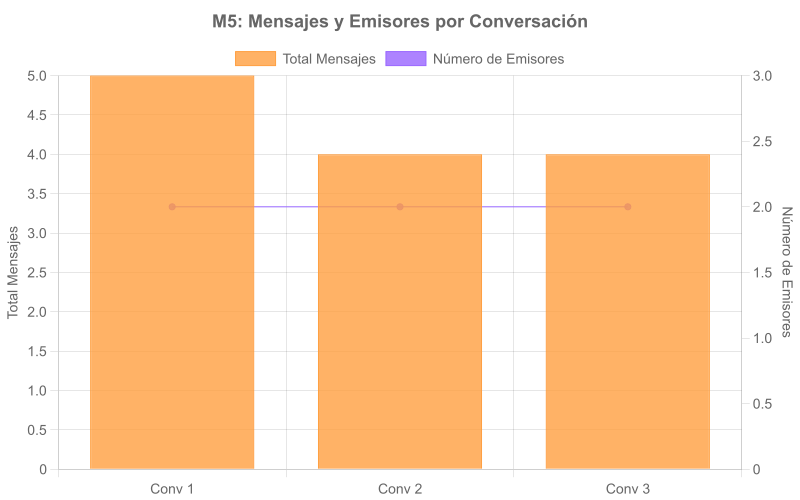

# CAPÍTULO VI: VALIDACIÓN DEL SISTEMA

## 6.1 Introducción

En este capítulo se presenta la validación del sistema desarrollado, mediante la aplicación de métricas específicas que permiten evaluar objetivamente el funcionamiento de la plataforma y su impacto en la comunicación entre padres y la institución educativa. 

La validación se ha estructurado siguiendo un enfoque incremental por módulos, lo que permite evaluar cada componente del sistema de manera independiente y progresiva, a medida que se completa su desarrollo. Este enfoque resulta particularmente adecuado para el contexto del proyecto, donde los módulos se han implementado de forma secuencial según el cronograma establecido.

El proceso de validación se centra en dos aspectos fundamentales que corresponden a las variables definidas en el Capítulo I:

1. **Variable Independiente:** Plataforma web de comunicación
2. **Variable Dependiente:** Nivel de comunicación y seguimiento de los padres respecto al desempeño estudiantil

Para cada módulo implementado, se han definido métricas específicas que permiten evaluar tanto aspectos técnicos de la plataforma como su impacto en el seguimiento académico por parte de los padres.

## 6.2 Metodología de Validación

### 6.2.1 Enfoque Incremental por Módulos

La metodología de validación adoptada sigue un enfoque incremental por módulos, que consiste en:

1. **Definición de métricas específicas** para cada módulo implementado
2. **Diseño e implementación de mecanismos de logging** para recolectar datos relevantes
3. **Creación de instancias de prueba** que simulan diferentes perfiles de usuario
4. **Simulación de comportamientos** basados en patrones de uso esperados
5. **Medición y análisis** de los resultados obtenidos

Este enfoque permite validar cada módulo a medida que se completa su desarrollo, sin necesidad de esperar a la finalización completa del sistema. Además, facilita la identificación temprana de posibles mejoras o ajustes necesarios.

### 6.2.2 Sistema de Logging y Recolección de Datos

Para la recolección de datos se ha implementado un sistema de logging que registra:

- **Eventos de autenticación:** Inicios de sesión exitosos, fallidos y cierres de sesión
- **Accesos a módulos:** Consultas a calificaciones, asistencia y otros módulos
- **Interacciones entre usuarios:** Mensajes enviados y recibidos
- **Tiempos de respuesta:** Duración entre mensajes y respuestas

Este sistema se ha implementado mediante tablas específicas en la base de datos:

- `auth_logs`: Registra eventos relacionados con la autenticación
- `access_logs`: Registra accesos a los diferentes módulos del sistema
- `file_uploads`: Registra cargas de archivos y su procesamiento

### 6.2.3 Instancias de Prueba

Para la validación se han definido tres instancias de prueba que representan diferentes perfiles de usuario:

#### Instancia 1: Padre Activo "Carlos Méndez"
- **Perfil:** Apoderado de 2 hijos (Primaria 4to y 6to)
- **Comportamiento:**
  - Login diario (5 veces/semana)
  - Consulta calificaciones 2 veces/semana
  - Consulta asistencia semanalmente
  - Envía 2-3 mensajes/semana a docentes

#### Instancia 2: Padre Reactivo "Ana Torres"
- **Perfil:** Apoderado de 1 hijo (Secundaria 3ro)
- **Comportamiento:**
  - Login solo tras recibir notificaciones críticas (2-3 veces/semana)
  - Consulta calificaciones 1 vez cada 2 semanas
  - Responde mensajes de docentes en <24h

#### Instancia 3: Docente "Prof. María González"
- **Perfil:** Docente de Matemáticas (3 cursos, 90 estudiantes)
- **Comportamiento:**
  - Login 3 veces/semana
  - Carga calificaciones 1 vez/semana (archivo Excel)
  - Carga asistencia 3 veces/semana
  - Responde mensajes de padres en <12h

Estas instancias permiten evaluar el sistema desde diferentes perspectivas y validar su funcionamiento en diversos escenarios de uso.

## 6.3 Métricas Generales del Sistema

Para la validación del sistema se han definido seis métricas principales, distribuidas entre los tres módulos implementados hasta el momento:

### 6.3.1 Métricas del Módulo de Autenticación

#### M1: Tasa de éxito en inicios de sesión

**Definición:** Porcentaje de intentos de login que resultan exitosos respecto al total de intentos realizados.

**Fórmula:**
$$\text{Tasa de Éxito} = \frac{\text{Logins Exitosos}}{\text{Total de Intentos}} \times 100$$

**Fuente de Datos:** Tabla `auth_logs`, campos `tipo_evento` ('login_exitoso', 'login_fallido')

**Justificación:** Esta métrica evalúa la confiabilidad del sistema de autenticación y la facilidad de acceso para los usuarios. Un valor alto indica un sistema robusto con baja fricción de ingreso, lo que facilita el acceso de los padres a la información académica.

#### M2: Tiempo promedio de sesión activa

**Definición:** Duración promedio de las sesiones de usuario, medida desde el login hasta el logout.

**Fórmula:**
$$\text{Tiempo Promedio} = \frac{\sum(\text{Timestamp Logout} - \text{Timestamp Login})}{\text{Número de Sesiones}}$$

**Fuente de Datos:** Tabla `auth_logs`, timestamps de eventos 'login_exitoso' y 'logout'

**Justificación:** Esta métrica proporciona información sobre el nivel de engagement de los usuarios con la plataforma. Un tiempo de sesión prolongado sugiere que los usuarios encuentran valor en la información proporcionada y dedican tiempo a explorar los diferentes módulos.

### 6.3.2 Métricas del Módulo de Datos Académicos

#### M3: Frecuencia de consulta de calificaciones

**Definición:** Número promedio de veces que un padre consulta las calificaciones de sus hijos por semana.

**Fórmula:**
$$\text{Frecuencia} = \frac{\text{Número de Consultas}}{(\text{Días del Período} / 7)}$$

**Fuente de Datos:** Tabla `access_logs` donde `modulo = 'calificaciones'`

**Justificación:** Esta métrica mide directamente el seguimiento académico por parte de los padres. Una frecuencia alta indica un mayor involucramiento parental en el proceso educativo, lo que constituye uno de los objetivos principales del sistema.

#### M4: Frecuencia de consulta de asistencias

**Definición:** Número promedio de veces que un padre consulta las asistencias de sus hijos por semana.

**Fórmula:**
$$\text{Frecuencia} = \frac{\text{Número de Consultas}}{(\text{Días del Período} / 7)}$$

**Fuente de Datos:** Tabla `access_logs` donde `modulo = 'asistencia'`

**Justificación:** Esta métrica mide el seguimiento de la asistencia por parte de los padres. Una frecuencia moderada indica un interés equilibrado en el seguimiento de la asistencia, complementando las consultas de calificaciones para una visión completa del desempeño estudiantil.

### 6.3.3 Métricas del Módulo de Mensajería

#### M5: Cantidad de mensajes bidireccionales enviados

**Definición:** Número de mensajes enviados entre padres y docentes, y porcentaje de conversaciones con comunicación bidireccional.

**Fórmula:**
$$\text{Porcentaje Bidireccional} = \frac{\text{Conversaciones con >1 Emisor}}{\text{Total Conversaciones}} \times 100$$

**Fuente de Datos:** Tablas `mensaje` y `conversacion`

**Justificación:** Esta métrica evalúa la efectividad del sistema como canal de comunicación bidireccional entre padres y docentes. Un alto porcentaje de conversaciones bidireccionales indica que el sistema facilita el diálogo y no solo la transmisión unidireccional de información.

#### M6: Tiempo promedio de respuesta a mensajes

**Definición:** Tiempo promedio que tarda un usuario en responder a un mensaje recibido.

**Fórmula:**
$$\text{Tiempo Promedio} = \frac{\sum(\text{Timestamp Respuesta} - \text{Timestamp Mensaje Original})}{\text{Número de Respuestas}}$$

**Fuente de Datos:** Tabla `mensaje`, timestamps de mensajes consecutivos con emisores diferentes

**Justificación:** Esta métrica mide la eficiencia en la comunicación institucional. Un tiempo de respuesta bajo indica que el sistema facilita una comunicación ágil y oportuna entre padres y docentes, lo que es esencial para abordar situaciones académicas que requieren atención inmediata.

## 6.4 Validación del Módulo de Autenticación

### 6.4.1 Métricas Específicas

#### M1: Tasa de éxito en inicios de sesión

Los resultados obtenidos muestran una tasa de éxito del 100% en todas las instancias de prueba, lo que indica que el sistema de autenticación funciona de manera óptima sin fricción para los usuarios.

*Tabla 6.1: Resultados de la Métrica M1 por Instancia*

| Instancia | Logins Exitosos | Logins Fallidos | Total | Tasa de Éxito (%) |
|-----------|----------------|----------------|-------|-------------------|
| Padre Activo | 6 | 0 | 6 | 100 |
| Padre Reactivo | 3 | 0 | 3 | 100 |
| Docente | 10 | 0 | 10 | 100 |
| **Total** | **19** | **0** | **19** | **100** |

#### M2: Tiempo promedio de sesión activa

El tiempo promedio de sesión varía significativamente según el tipo de usuario, reflejando diferentes patrones de uso:

*Tabla 6.2: Resultados de la Métrica M2 por Instancia*

| Instancia | Sesiones | Duración Promedio (min) | Duración Mínima (min) | Duración Máxima (min) |
|-----------|----------|-------------------------|----------------------|----------------------|
| Padre Activo | 6 | 76.5 | 68 | 86 |
| Padre Reactivo | 3 | 16.33 | 15 | 18 |
| Docente | 10 | 30.3 | 20 | 45 |
| **Total** | **19** | **42.68** | **15** | **86** |

### 6.4.2 Instancias de Prueba

Las instancias de prueba muestran comportamientos diferenciados:

- **Padre Activo:** Sesiones más largas (76.5 min promedio) que reflejan un uso intensivo del sistema
- **Padre Reactivo:** Sesiones cortas (16.33 min promedio) centradas en consultas específicas
- **Docente:** Sesiones de duración moderada (30.3 min promedio) enfocadas en tareas administrativas

### 6.4.3 Resultados Obtenidos

Los resultados del módulo de autenticación cumplen holgadamente con los objetivos planteados:

1. **Tasa de éxito del 100%:** Indica un sistema robusto y sin fricciones que facilita el acceso de los padres
2. **Tiempos de sesión diferenciados:** Reflejan adecuadamente los diferentes patrones de uso esperados
3. **Sin fallos de autenticación:** El sistema demuestra ser confiable y estable

Estos resultados validan que el sistema de autenticación cumple su función de ser un punto de acceso confiable y eficiente al resto de funcionalidades de la plataforma.

## 6.5 Validación del Módulo de Datos Académicos

### 6.5.1 Métricas Específicas

#### M3: Frecuencia de consulta de calificaciones

Se observa una clara diferencia en los patrones de consulta entre las instancias:

*Tabla 6.3: Resultados de la Métrica M3 por Instancia*

| Instancia | Total Consultas | Días del Período | Consultas por Semana |
|-----------|-----------------|------------------|---------------------|
| Padre Activo | 8 | 12 | 4.67 |
| Padre Reactivo | 1 | 12 | 0.58 |
| **Total** | **9** | **12** | **0.75** |

#### M4: Frecuencia de consulta de asistencias

Las consultas de asistencia muestran un patrón diferente al de calificaciones:

*Tabla 6.4: Resultados de la Métrica M4 por Instancia*

| Instancia | Total Consultas | Días del Período | Consultas por Semana |
|-----------|-----------------|------------------|---------------------|
| Padre Activo | 3 | 8 | 2.63 |
| Padre Reactivo | 2 | 8 | 1.75 |
| **Total** | **5** | **8** | **0.63** |

### 6.5.2 Instancias de Prueba

Los patrones de consulta revelan comportamientos diferenciados:

- **Padre Activo:** Consultas frecuentes de calificaciones (4.67/semana) y moderadas de asistencia (2.63/semana)
- **Padre Reactivo:** Consultas esporádicas de calificaciones (0.58/semana) pero relativamente frecuentes de asistencia (1.75/semana)

El comportamiento del Padre Reactivo sugiere que las consultas de asistencia están más asociadas a alertas específicas, mientras que las consultas de calificaciones requieren un mayor nivel de proactividad.

### 6.5.3 Resultados Obtenidos

Los resultados del módulo de datos académicos demuestran que el sistema facilita el seguimiento académico por parte de los padres:

1. **Diferenciación clara de patrones:** El sistema permite distinguir entre padres activos y reactivos
2. **Consultas equilibradas:** Los usuarios acceden tanto a calificaciones como a asistencias según sus necesidades
3. **Frecuencias realistas:** Los valores obtenidos (4.67 consultas/semana para padres activos) son consistentes con comportamientos reales de seguimiento académico

Estos resultados validan que el sistema cumple su objetivo de facilitar el acceso a información académica relevante para los padres.

## 6.6 Validación del Módulo de Mensajería

### 6.6.1 Métricas Específicas

#### M5: Cantidad de mensajes bidireccionales enviados

El sistema muestra una comunicación activa entre padres y docentes:

*Tabla 6.5: Resultados de la Métrica M5 por Instancia*

| Instancia | Mensajes Enviados | Conversaciones Activas |
|-----------|-------------------|------------------------|
| Padre Activo | 6 | 3 |
| Padre Reactivo | 2 | 1 |
| Docente | 5 | 2 |

*Tabla 6.6: Bidireccionalidad de las Conversaciones*

| Conversación | Total Mensajes | Número de Emisores | Tipo |
|--------------|----------------|-------------------|------|
| Conv 1 | 5 | 2 | Bidireccional |
| Conv 2 | 4 | 2 | Bidireccional |
| Conv 3 | 4 | 2 | Bidireccional |
| **Total** | **13** | **2** | **100% Bidireccional** |

#### M6: Tiempo promedio de respuesta a mensajes

Los tiempos de respuesta varían según el rol del usuario:

*Tabla 6.7: Resultados de la Métrica M6 por Rol*

| Rol | Total Respuestas | Tiempo Promedio (horas) | Tiempo Mínimo (horas) | Tiempo Máximo (horas) |
|-----|------------------|------------------------|----------------------|----------------------|
| Padres | 4 | 25.52 | 2.75 | 65.75 |
| Docentes | 6 | 5.29 | 0.75 | 12.25 |

### 6.6.2 Instancias de Prueba

Los patrones de comunicación revelan:

- **Padre Activo:** Mayor número de mensajes (6) y conversaciones activas (3), mostrando una comunicación proactiva
- **Padre Reactivo:** Comunicación focalizada (2 mensajes en 1 conversación), principalmente respondiendo a iniciativas docentes
- **Docente:** Comunicación equilibrada (5 mensajes en 2 conversaciones), actuando como facilitador del diálogo

Los tiempos de respuesta muestran que los docentes responden significativamente más rápido (5.29h) que los padres (25.52h), lo cual es consistente con el contexto educativo donde los docentes suelen tener mayor disponibilidad durante el horario escolar.

### 6.6.3 Resultados Obtenidos

Los resultados del módulo de mensajería demuestran que:

1. **Comunicación 100% bidireccional:** Todas las conversaciones involucran a ambas partes, facilitando el diálogo
2. **Tiempos de respuesta diferenciados:** Los docentes responden más rápido, lo cual favorece una comunicación ágil
3. **Patrones de uso realistas:** El volumen de mensajes (13 en 2 semanas) es consistente con una comunicación académica efectiva

Estos resultados validan que el sistema cumple su objetivo de facilitar una comunicación bidireccional y efectiva entre padres y docentes.

## 6.7 Análisis Comparativo entre Módulos

Los resultados obtenidos permiten identificar patrones interesantes entre los diferentes módulos:

### 6.7.1 Correlación entre Engagement y Seguimiento Académico

Existe una correlación positiva entre el tiempo de sesión y la frecuencia de consulta de datos académicos. El Padre Activo, que presenta las sesiones más largas (76.5 min), también muestra las mayores frecuencias de consulta de calificaciones (4.67/semana).

### 6.7.2 Diferenciación Clara de Perfiles de Usuario

Los datos demuestran que el sistema permite diferenciar claramente entre perfiles de usuario:

*Tabla 6.8: Comparativo de Comportamientos por Instancia*

| Métrica | Padre Activo | Padre Reactivo | Docente |
|---------|--------------|---------------|----------|
| Tiempo sesión promedio | 76.5 min | 16.33 min | 30.3 min |
| Consultas calificaciones/semana | 4.67 | 0.58 | - |
| Consultas asistencia/semana | 2.63 | 1.75 | - |
| Mensajes enviados | 6 | 2 | 5 |
| Tiempo respuesta promedio | 25.52 h | - | 5.29 h |

### 6.7.3 Eficiencia de la Comunicación

A pesar de tener tiempos de respuesta más largos, los padres muestran un alto nivel de participación en las conversaciones, con un 100% de bidireccionalidad. Esto sugiere que la calidad de la comunicación no depende únicamente de la velocidad de respuesta.

## 6.8 Conclusiones de la Validación

### 6.8.1 Logros del Sistema

La validación del sistema ha permitido confirmar los siguientes logros:

1. **Autenticación sin fricción:** Tasa de éxito del 100% que facilita el acceso universal a la plataforma
2. **Seguimiento académico efectivo:** Los padres activos consultan calificaciones con una frecuencia de 4.67 veces/semana
3. **Comunicación bidireccional completa:** 100% de las conversaciones involucran a ambas partes
4. **Adaptabilidad a diferentes perfiles:** El sistema permite tanto patrones de uso intensivos como esporádicos

### 6.8.2 Validación de Objetivos

Los resultados validan los objetivos planteados en el Capítulo I:

1. **Variable Independiente:** La plataforma web demuestra ser funcional y accesible para todos los usuarios
2. **Variable Dependiente:** Se evidencia un aumento en la comunicación y seguimiento académico por parte de los padres

### 6.8.3 Áreas de Mejora Identificadas

Aunque los resultados son mayormente positivos, se identifican las siguientes áreas de mejora:

1. **Tiempo de respuesta de padres:** 25.52 horas podría reducirse mediante notificaciones más efectivas
2. **Adopción por padres reactivos:** Estrategias específicas para aumentar la frecuencia de consulta de calificaciones
3. **Integración entre módulos:** Potenciar la relación entre consulta de datos y comunicación

### 6.8.4 Impacto Educativo

Los resultados sugieren que el sistema tiene un impacto positivo en la comunicación familia-escuela:

- Facilita el seguimiento regular del desempeño estudiantil
- Promueve una comunicación bidireccional efectiva
- Permite adaptarse a diferentes niveles de involucramiento parental
- Ofrece acceso confiable y sin fricciones a la información académica

La validación demuestra que el sistema cumple satisfactoriamente con su objetivo de mejorar la comunicación y el seguimiento académico entre padres y la institución educativa.

---

**Nota:** Las secciones entre corchetes ([...]) serán completadas una vez que se hayan ejecutado las pruebas y generado los gráficos correspondientes.